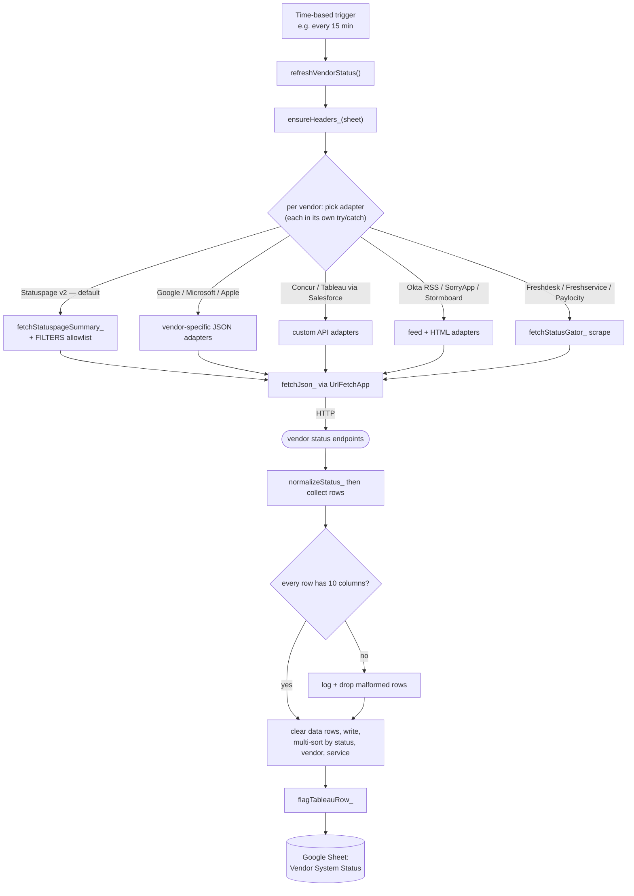

# RHR Vendor System Status Dashboard

Last updated: 2026-06-22 06:28 AM CDT

A Google Apps Script / Node.js project that monitors the live status of RHR International's SaaS vendor ecosystem by polling each vendor's public status API and writing the results to a Google Sheet.

## Purpose

Provides a single-pane view of operational health across 25+ vendors — 1Password, Alteryx, Apple, Calendly, Celigo, Cloudflare, Concur, Docusign, Freshdesk/Freshservice, GitHub, Google Workspace, HubSpot, Jamf, KnowBe4, Microsoft, Monday.com, Okta, Seismic, Zoom, and more.

## How it works

A time-based Apps Script trigger runs `refreshVendorStatus()`, which polls each
vendor in `FEEDS` and writes a normalized row set to the sheet. Most vendors
expose a standard **Statuspage v2** summary, parsed by one generic adapter
(`fetchStatuspageSummary_`, with an optional `FILTERS` component allowlist);
vendors that don't (Google, Microsoft, Apple, Concur, Tableau/Salesforce, Okta
RSS, SorryApp, Stormboard, StatusGator-scraped) get their own adapter. **Every
adapter call is wrapped in its own `try/catch`**, so one vendor's outage or API
change degrades that one row, never the whole run.



## Tech Stack

- **Runtime:** Google Apps Script (V8)
- **Output:** Google Sheets (`Vendor System Status` tab)
- **Status sources:** Statuspage v2 API, StatusGator scraping, vendor-specific APIs
- **Dev tooling:** `@types/google-apps-script` for IDE type support

## Prerequisites

- Google Workspace account with Apps Script access
- [clasp](https://github.com/google/clasp) for local development (`npm install -g @google/clasp`)
- Node.js (for type checking / dev tooling only — not used at runtime)

## Setup

1. Clone the repo and install dev dependencies:
   ```bash
   git clone git@github.com:bjgreenberg/vendor-dashboard.git
   cd vendor-dashboard
   npm install
   ```
2. Authenticate clasp:
   ```bash
   clasp login
   ```
3. Link to your Apps Script project:
   ```bash
   clasp clone <scriptId>
   # or push to existing project:
   clasp push
   ```
4. In Apps Script → Project Settings, confirm the script is bound to the correct Google Sheet.
5. Set up a time-based trigger to run `refreshVendorStatus` on your desired schedule (e.g. every 15 minutes). _(This is the single entry point — see [How it works](#how-it-works).)_

## Secrets

No API keys are hardcoded. Any credentials required by specific vendor APIs should be stored in Apps Script **Script Properties** (Project Settings → Script Properties), not in source code.

## Project Structure

| File | Purpose |
|------|---------|
| `Code.js` | Main script — `FEEDS`/`FILTERS`/`HEADERS` config, the `refreshVendorStatus()` entry point, and all per-vendor fetch/parse adapters |
| `appsscript.json` | Apps Script manifest |
| `package.json` | Dev dependencies (`@types/google-apps-script`) |
| `.gitignore` | Excludes `node_modules/`, `.clasp.json`, `creds.json` |

## Known Issues

- `npm` symlink is broken on the dev machine (`/opt/homebrew/opt/npm` points to a missing Cellar path). Run `brew reinstall node` to fix before running `npm audit`.
- `jsconfig.json.` has a trailing dot in the filename — likely a typo; rename to `jsconfig.json` if IDE support is needed.

## CI

Every pull request, and every push to `main`, runs the `test` job of the CI
workflow ([.github/workflows/ci.yml](.github/workflows/ci.yml)):

- `node --check` on every tracked `.js` file (syntax gate — Apps Script code
  has no unit tests yet)
- `npm audit --audit-level=high` against the committed lockfile
- `docs-render` — renders every Mermaid diagram in the repo's Markdown via the
  digest-pinned `mermaid-cli` container (`scripts/render-diagrams.sh`), so an
  unrenderable diagram can't merge

## Branch protection

PR flow per senior-engineering-partner v2.9: `main` is protected — changes go
branch → PR → merge. The `test` and `docs-render` CI checks are required: PRs
cannot merge until they pass. Linear history, enforced for admins.
