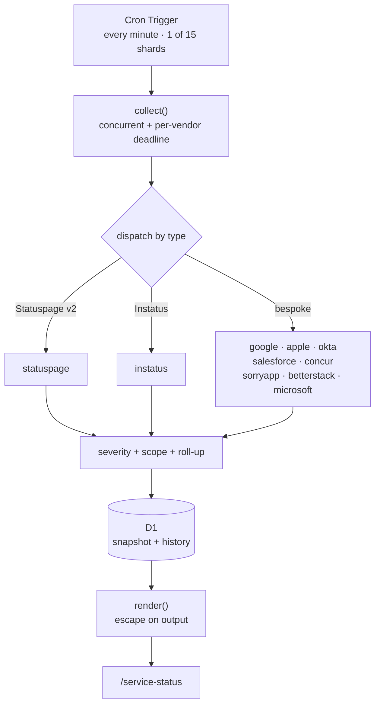
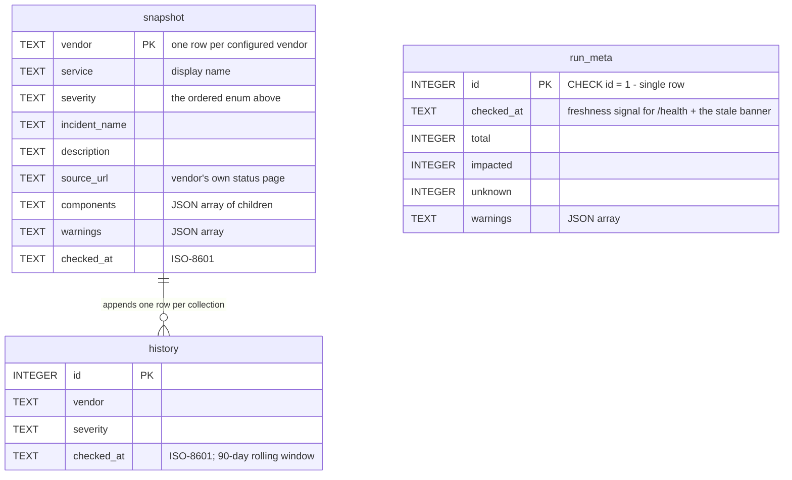

# Vendor Status Dashboard

[](LICENSE)
[](https://github.com/bjgreenberg/vendor-dashboard/releases)
[](https://github.com/bjgreenberg/vendor-dashboard/actions/workflows/test.yml)
[](https://github.com/bjgreenberg/vendor-dashboard/actions/workflows/lint.yml)
[](https://github.com/bjgreenberg/vendor-dashboard/actions/workflows/perf.yml)
[](https://github.com/bjgreenberg/vendor-dashboard/actions/workflows/docs-render.yml)
[](https://github.com/bjgreenberg/vendor-dashboard/actions/workflows/cff-validate.yml)
[](https://github.com/bjgreenberg/vendor-dashboard/actions/workflows/secret-scan.yml)
[](https://scorecard.dev/viewer/?uri=github.com/bjgreenberg/vendor-dashboard)
[](https://www.bestpractices.dev/projects/13942)
[](https://www.conventionalcommits.org/en/v1.0.0/)

Last updated: 2026-08-03 08:50 AM CDT

Monitors the live operational status of a configurable set of SaaS and cloud
services by polling each vendor's own public status endpoint, and serves a
single-pane dashboard. Runs as a Cloudflare Worker; every vendor is
re-checked on a 15-minute cycle.

Live at **<https://briangreenberg.net/service-status>**.

> **What this repo is:** a working reference implementation, wired to
> briangreenberg.net — the dashboard reuses that site's chrome, stylesheet and
> theme keys (`src/worker/render.js`). To run your own: fork, replace
> [`config/vendors.json`](config/vendors.json) with your vendor set, swap the
> header/footer markup, and deploy. The engine (`src/engine/`) is deliberately
> runtime-agnostic and does not know Cloudflare exists.

## Contents

- [Why it exists](#why-it-exists)
- [How it works](#how-it-works)
- [Configuring vendors](#configuring-vendors)
- [Project structure](#project-structure)
- [Development](#development)
- [Deployment](#deployment)
- [CI gates](#ci-gates)
- [Design decisions](#design-decisions)
- [Known limitations](#known-limitations)
- [Troubleshooting](#troubleshooting)
- [Going public](#going-public)
- [License](#license)

## Why it exists

A status board is only worth having if you can trust it. The predecessor to this
tool — a single-file Google Apps Script — was audited in July 2026 and found to
have **four independent sources of false green**: vendors that displayed
"Operational" regardless of reality.

| Finding | Vendor | Mechanism |
|---|---|---|
| H1 | Microsoft | fetched the endpoint, discarded the result, returned a hardcoded literal |
| H6 | Stormboard | vendor moved to Better Stack; a bare `/\boperational\b/` matched its markup |
| H7 | Concur | vendor became a JS app; the scraped strings vanished and the sanity guard was defeated by the page `<title>` |
| H4 | Concur, others | a network error returned a row whose status column read `Operational` |

The common cause was not any single bug: it was the absence of any test
asserting an adapter's output against a recorded payload. Every one of those
would have failed red on the first fixture-pinned assertion.

The full report is in [`docs/audit/`](docs/audit/). Its findings are the
acceptance criteria for this rewrite, and the fixes are pinned by tests.

**The governing rule: an unverifiable status is `unknown`, never `operational`.**
Failing closed is the whole point.

## How it works

A Cron Trigger fires **every minute** and collects one of **15 shards**, so
each vendor is still re-checked every 15 minutes (`shards × interval` is the
refresh promise; sharding was forced by the free plan's 50-subrequest and
10 ms CPU ceilings and retained after the 2026-08-02 move to Workers Paid —
tiny invocations and per-vendor blast-radius isolation are worth keeping).
The Worker fetches its shard's vendors concurrently,
normalizes each response into a common record, writes a snapshot
transactionally to D1, and serves a rendered dashboard.



**Severity** is an ordered enum, not a boolean:

```
major_outage > partial_outage > degraded > unknown > maintenance > operational
```

`unknown` deliberately outranks `operational` — a check that failed is not
evidence of health — and sits below `maintenance` in urgency terms only because
planned maintenance is a *known* benign state.

**How a vendor's status is decided:**

- **With a scope configured** — severity is the worst of the *in-scope
  components only*. The vendor's own page indicator is ignored, because the
  operator has declared what they care about.
- **Without a scope** — severity is the worst of the page indicator and all
  components.
- **Incidents never contribute to severity**, only to context. Deriving status
  from incidents alone caused errors in both directions in the predecessor.
- **The board judges from a US vantage point, and the page says so.** For
  vendors publishing per-region status, `scope` picks the US components that
  vote on severity, while `componentLevel: 'group'` keeps the card showing the
  vendor's service groups with non-US trouble as detail: it informs, but it
  does not vote. Scope and group mode compose (applied to OutSystems, and to AWS via region-code
  prefixes in its bespoke adapter);
  a scope that matches nothing live fails closed to `unknown`, because an
  empty selection is not health.

**Roll-up:** a vendor is a parent over many sub-services. All healthy renders one
collapsed row; anything unhealthy renders the parent plus **only** the affected
children. Zoom publishes 283 components — you should never see 283 green rows.

### Data model



`snapshot` is the current board, replaced per-shard inside one transaction so a
reader never sees a half-written board. `history` is a 90-day rolling window
(pruned in the same write batch) for uptime/MTTR analysis. `run_meta` is the
single-row freshness record that `/health`, the stale banner, and the external
dead-man monitor all read.

## Configuring vendors

The monitored set lives entirely in [`config/vendors.json`](config/vendors.json).
**No vendor list exists in source code.** That separation is what lets one
codebase serve different deployments with different configs.

```jsonc
{
  "name": "Cloudflare",
  "type": "statuspage",
  "url": "https://www.cloudflarestatus.com/api/v2/summary.json",
  "scope": { "groups": ["Cloudflare Sites and Services"] }
}
```

| Field | Purpose |
|---|---|
| `type` | Which adapter parses the feed (see the file's own `$comment`) |
| `url` | The status endpoint |
| `scope` | Optional. Restrict which components count, by `groups` or exact `components` names |
| `dataCenters` | Concur only — restrict to named data centres |
| `bannerUrl` | Concur only — its secondary "something is wrong" signal |

**Scoping matters more than it looks.** Cloudflare publishes ~470 components,
most of them edge PoPs. Without a scope, routine re-routing in Arica or Guam —
the redundancy working as designed — drags the row amber. Measured 2026-07-30:
unscoped 46 non-operational, services-only 0.

If a configured component name matches nothing in the live payload, the run
emits a warning rather than silently ignoring it.

## Project structure

| Path | Purpose |
|---|---|
| `src/engine/` | **Runtime-agnostic.** Pure functions, no platform APIs. Testable in plain Node |
| `src/engine/adapters/` | One module per feed format |
| `src/engine/severity.js` | Ordered enum, vendor-vocabulary normalization |
| `src/engine/scope.js` | Component/group allowlist + drift detection |
| `src/engine/rollup.js` | Parent roll-up and progressive disclosure |
| `src/engine/collect.js` | Orchestrator: concurrency, deadlines, bounded retry |
| `src/worker/` | Cloudflare bindings **only** — `scheduled()`, `fetch()`, D1, rendering |
| `config/` | Vendor configuration |
| `migrations/` | D1 schema as ordered migrations (`wrangler d1 migrations apply`) |
| `test/fixtures/` | Recorded vendor payloads (golden fixtures) |
| `docs/audit/` | The extraction audit driving this rewrite |

The engine deliberately contains **no** Worker, GCP, or Apps Script APIs. The
caller injects `fetchFn` and `now`, which is what makes it testable without a
network and portable to another runtime.

## Development

```bash
npm ci
node scripts/fetch-logos.mjs   # regenerate vendor marks (build artifact — see below)
npm test                       # full unit suite (runs in ~1 s)
npm run test:watch
npx wrangler dev               # local Worker
```

**Vendor marks are a build artifact, not repo content.** Serving each vendor's
own favicon on the dashboard is ordinary nominative use; *redistributing* 46
trademarked marks in a public repository is a different act, so the icon
directories are gitignored. `fetch-logos.mjs` downloads each vendor's declared
favicon (magic-byte validated — a bot wall's challenge page is refused), mirrors
it into the served `public/` directory, and regenerates
[`config/logos.json`](config/logos.json). The manifest *is* tracked because the
renderer imports it at build time; on a clone that has never run the script,
the icon test gates skip loudly and rows fall back to their status dots.

Tests run against recorded fixtures — no network required, and deterministic
because the clock is injected.

## Deployment

```bash
npm run deploy   # fetch-logos → d1 migrations apply → wrangler deploy
```

Requires `wrangler login` (OAuth) or `CLOUDFLARE_API_TOKEN`. The script order
matters: logos first (deploy uploads whatever is in the gitignored `public/`
icons dir — without this step the board ships without vendor marks), then
migrations (idempotent; D1 tracks applied ones), then the Worker itself.

### Deploy your own

[](https://deploy.workers.cloudflare.com/?url=https://github.com/bjgreenberg/vendor-dashboard)

One click forks this repo into your own GitHub and Cloudflare accounts,
provisions a fresh D1 database from the Wrangler config, and runs `npm run
deploy` — migrations and vendor logos included. (The button works once this
repository is public.) Then make it yours:

1. Replace [`config/vendors.json`](config/vendors.json) with your vendor set
   (each entry's `brandDomain` is what the logo fetcher uses).
2. **Delete or repoint the `routes` block in `wrangler.jsonc`** — it binds to
   briangreenberg.net, which is not your zone. Your deployment serves on your
   `*.workers.dev` subdomain immediately (`BASE_PATH` handles both mounts).
3. Swap the site chrome in `src/worker/render.js` (header, footer, share bar)
   for your own.

Routing is declared in [`wrangler.jsonc`](wrangler.jsonc) as a **route**, not a
Custom Domain. `briangreenberg.net` is itself a Custom Domain bound to a
different Worker; a route on a sub-path runs *before* the Custom Domain Worker,
so `/service-status*` is intercepted and every other path reaches the site
untouched.

> ⚠️ **Never declare `custom_domain` in `wrangler.jsonc`.** Wrangler skips the
> changeset preview and force-overrides DNS whenever stdout is not a TTY (CI,
> agent shells) — on a zone a live site depends on. A plain route does not touch
> DNS.

⚠️ **Deploys take 20–30 seconds to propagate.** Testing sooner produces
convincing false failures — 404s on paths that are configured correctly.
Cache-busting does not help, because it is not caching.

## CI gates

All must pass before merge:

| Job | What it proves |
|---|---|
| `test` | the unit suite, every adapter pinned against a recorded payload; per-file coverage floors; plus `wrangler --dry-run` build check and `npm audit --audit-level=high` |
| `lint` | `eslint .` — zero findings |
| `perf` | per-shard parse-cost regression envelope (150 ms) — catches the multi-megabyte-feed class of mistake |
| `secret-scan` | gitleaks over full history **and** working tree |
| `cff-validate` | `CITATION.cff` against the CFF schema |
| `docs-render` | every Mermaid block renders (a broken diagram is a broken deliverable) |

One workflow per gate (mirroring the skill repo), so each carries its own live badge. All third-party Actions are SHA-pinned; container tools are digest-pinned.

## Design decisions

- **Config is not code.** The vendor list lives in JSON so one codebase can
  serve multiple deployments.
- **The engine is runtime-agnostic on purpose.** Costs nothing, and keeps a
  future non-Cloudflare deployment possible.
- **Fail closed, everywhere.** Null, malformed, unrecognised, unreachable — all
  become `unknown`. A green row must mean something was actually verified.
- **An empty board is not a healthy board.** Zero records renders "No status
  data", never "All systems operational".
- **Staleness is surfaced.** If the newest snapshot is older than two collection
  intervals, the page says so — the dead-man's switch for our own cron.
- **Vendor content is untrusted input.** Every vendor feed is escaped on
  output; a strict CSP with a per-response nonce is the second line.
- **404 is treated as retryable**, unusually. Microsoft's endpoint was measured
  at ~50% availability; the cost of being wrong is bounded because the answer
  after the cap is still `unknown`.
- **Retries share a run-wide budget** — originally because the free plan
  killed an invocation at 50 subrequests; kept on Workers Paid as a sanity
  bound that turns a retry storm into a loud, bounded failure.
- **Honest User-Agent.** The predecessor forged a Chrome 91 string from 2021; a
  stale forged UA is *more* likely to be bot-filtered than an honest one.

## Known limitations

- **Freshdesk, Freshservice and Paylocity are not monitored.** None publishes a
  public machine-readable status endpoint (verified 2026-07-30: Freshworks'
  Statuspage returns 401 "page is inactive", `status.freshworks.com` is a JS
  shell, `status.paylocity.com` redirects to a login portal). They were
  previously sourced via StatusGator, a third-party aggregator, which is no
  longer used. **A monitored row with no real data source reports health it
  never verified**, so they are omitted rather than faked.
- **Microsoft covers consumer services only.** That endpoint reports
  Outlook.com, OneDrive, Phone Link and Teams Free. Exchange Online, SharePoint,
  Entra, Intune and Defender are absent. The row is labelled accordingly.
  Enterprise tenant health requires the authenticated Microsoft Graph Service
  Health API.
- **Signal cannot show a component breakdown** — it publishes a single
  page-level sentence and nothing underneath (verified 2026-08-01). Every
  other vendor now lists components, several via secondary catalogue
  endpoints found by reading their status pages' network logs.
- **Okta has no public JSON API** — `summary.json`, `index.json`,
  `history.atom` and `history.rss` all return 401. The adapter parses the
  incident records the status page embeds as JSON, using `indexOf` plus a linear
  bracket walk rather than regex — written against the original free plan's
  10 ms CPU budget and kept because cheap parsing is still enforced (see the
  `perf` gate).
- **No uptime history UI yet.** History *is* recorded from day one; only the
  reporting is unbuilt.

## Troubleshooting

| Symptom | Cause / fix |
|---|---|
| Paths 404 right after deploy | Propagation lag. Wait 20–30 s and retest before debugging |
| A vendor shows `unknown` | Read its `warnings` in `/service-status/api/status` — it names the HTTP status or parse failure |
| Board reads "No status data" | The cron has not run yet, or is failing. Check `wrangler tail` and `run_meta` in D1 |
| Vendor logos vanished after `git pull` | You pulled across the commit that untracked the icon dirs — git removed the previously-tracked files. Run `node scripts/fetch-logos.mjs`, or restore the exact prior set: `git checkout <pre-untracking-sha> -- assets/icons public/service-status/icons && git restore --staged assets/icons public/service-status/icons` |
| Is collection alive right now? | `curl -sf /service-status/health` — 200 with `age_minutes` while fresh; 503 once the snapshot is older than three cycles (45 min) or D1 is unreachable |
| "This data may be stale" banner | Collection has not succeeded in >30 minutes. The collector, not the vendors, is the problem |
| `Apple` unknown locally but fine in production | A host with no IPv6 egress. Node's fetch tries AAAA first; Apple is the only vendor publishing AAAA records |
| Deploy fails: "CPU limits are not supported for the Free plan" | The declared `limits` block is a deliberate tripwire: it means the Workers Paid subscription has lapsed. Restore the plan (or consciously remove the block AND accept 10 ms CPU kills) |

## Going public

Public since **2026-08-02**. The record of how it got here, for anyone
auditing the process:

- The 2026-08-01 security audit (`AUDIT:` mode, senior-engineering-partner
  skill) was fully remediated in PRs #32–#52 before the flip, with finding IDs
  traceable through every PR.
- History hygiene is verified mechanically, not asserted: gitleaks runs over
  the **full history** as a required check (the two fingerprints in
  `.gitleaksignore` are documented public identifiers, not credentials), and
  the tree was swept for internal references before publication.
- Vendor logos were untracked pre-flip (trademark-clean tree; see NOTICE and
  the Development section) and are regenerated at build time.
- `main` is protected by the **main-protection ruleset**: squash-only merges,
  one approving review (repo-admin bypass for solo maintenance), six required
  status checks (`test`, `lint`, `perf`, `docs-render`, `cff-validate`,
  `secret-scan`), strict up-to-date, linear history, signed commits, no
  deletions or force pushes. Tags matching `v*` are protected against
  deletion and moves.
- Secret scanning + push protection, private vulnerability reporting, and
  fork-PR workflow approval (all external contributors) are enabled.
- Releases are cut by release-please; the Release badge above reflects the
  latest tagged release.

## License

Licensed under the [Apache License 2.0](LICENSE).
