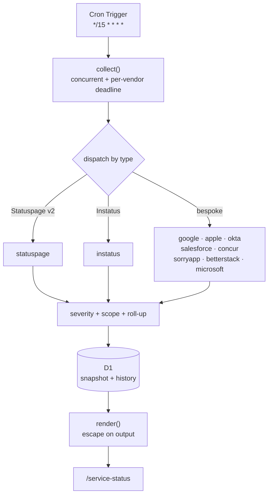

# Vendor Status Dashboard

[](https://github.com/bjgreenberg/vendor-dashboard/actions/workflows/ci.yml)
[](LICENSE)

Last updated: 2026-08-01 06:07 PM CDT

Monitors the live operational status of a configurable set of SaaS and cloud
services by polling each vendor's own public status endpoint, and serves a
single-pane dashboard. Runs as a Cloudflare Worker on a 15-minute schedule.

Live at **<https://briangreenberg.net/service-status>**.

> **Note on badges:** the **Release** and **OpenSSF Scorecard** badges are
> intentionally absent while this repository is **private** — both services read
> the repo over the public API and would render an error, which is worse than no
> badge. They are staged in [Going public](#going-public).

## Contents

- [Why it exists](#why-it-exists)
- [How it works](#how-it-works)
- [Configuring vendors](#configuring-vendors)
- [Project structure](#project-structure)
- [Development](#development)
- [Deployment](#deployment)
- [CI gates](#ci-gates)
- [Design decisions](#design-decisions)
- [Known limitations](#known-limitations)
- [Troubleshooting](#troubleshooting)
- [Going public](#going-public)
- [License](#license)

## Why it exists

A status board is only worth having if you can trust it. The predecessor to this
tool — a single-file Google Apps Script — was audited in July 2026 and found to
have **four independent sources of false green**: vendors that displayed
"Operational" regardless of reality.

| Finding | Vendor | Mechanism |
|---|---|---|
| H1 | Microsoft | fetched the endpoint, discarded the result, returned a hardcoded literal |
| H6 | Stormboard | vendor moved to Better Stack; a bare `/\boperational\b/` matched its markup |
| H7 | Concur | vendor became a JS app; the scraped strings vanished and the sanity guard was defeated by the page `<title>` |
| H4 | Concur, others | a network error returned a row whose status column read `Operational` |

The common cause was not any single bug: it was the absence of any test
asserting an adapter's output against a recorded payload. Every one of those
would have failed red on the first fixture-pinned assertion.

The full report is in [`docs/audit/`](docs/audit/). Its findings are the
acceptance criteria for this rewrite, and the fixes are pinned by tests.

**The governing rule: an unverifiable status is `unknown`, never `operational`.**
Failing closed is the whole point.

## How it works

A Cron Trigger fires every 15 minutes. The Worker fetches every configured
vendor concurrently, normalizes each response into a common record, writes a
snapshot transactionally to D1, and serves a rendered dashboard.



**Severity** is an ordered enum, not a boolean:

```
major_outage > partial_outage > degraded > unknown > maintenance > operational
```

`unknown` deliberately outranks `operational` — a check that failed is not
evidence of health — and sits below `maintenance` in urgency terms only because
planned maintenance is a *known* benign state.

**How a vendor's status is decided:**

- **With a scope configured** — severity is the worst of the *in-scope
  components only*. The vendor's own page indicator is ignored, because the
  operator has declared what they care about.
- **Without a scope** — severity is the worst of the page indicator and all
  components.
- **Incidents never contribute to severity**, only to context. Deriving status
  from incidents alone caused errors in both directions in the predecessor.

**Roll-up:** a vendor is a parent over many sub-services. All healthy renders one
collapsed row; anything unhealthy renders the parent plus **only** the affected
children. Zoom publishes 283 components — you should never see 283 green rows.

## Configuring vendors

The monitored set lives entirely in [`config/vendors.json`](config/vendors.json).
**No vendor list exists in source code.** That separation is what lets one
codebase serve different deployments with different configs.

```jsonc
{
  "name": "Cloudflare",
  "type": "statuspage",
  "url": "https://www.cloudflarestatus.com/api/v2/summary.json",
  "scope": { "groups": ["Cloudflare Sites and Services"] }
}
```

| Field | Purpose |
|---|---|
| `type` | Which adapter parses the feed (see the file's own `$comment`) |
| `url` | The status endpoint |
| `scope` | Optional. Restrict which components count, by `groups` or exact `components` names |
| `dataCenters` | Concur only — restrict to named data centres |
| `bannerUrl` | Concur only — its secondary "something is wrong" signal |

**Scoping matters more than it looks.** Cloudflare publishes ~470 components,
most of them edge PoPs. Without a scope, routine re-routing in Arica or Guam —
the redundancy working as designed — drags the row amber. Measured 2026-07-30:
unscoped 46 non-operational, services-only 0.

If a configured component name matches nothing in the live payload, the run
emits a warning rather than silently ignoring it.

## Project structure

| Path | Purpose |
|---|---|
| `src/engine/` | **Runtime-agnostic.** Pure functions, no platform APIs. Testable in plain Node |
| `src/engine/adapters/` | One module per feed format |
| `src/engine/severity.js` | Ordered enum, vendor-vocabulary normalization |
| `src/engine/scope.js` | Component/group allowlist + drift detection |
| `src/engine/rollup.js` | Parent roll-up and progressive disclosure |
| `src/engine/collect.js` | Orchestrator: concurrency, deadlines, bounded retry |
| `src/worker/` | Cloudflare bindings **only** — `scheduled()`, `fetch()`, D1, rendering |
| `config/` | Vendor configuration |
| `db/schema.sql` | D1 schema |
| `test/fixtures/` | Recorded vendor payloads (golden fixtures) |
| `docs/audit/` | The extraction audit driving this rewrite |

The engine deliberately contains **no** Worker, GCP, or Apps Script APIs. The
caller injects `fetchFn` and `now`, which is what makes it testable without a
network and portable to another runtime.

## Development

```bash
npm ci
npm test              # full unit suite (runs in ~1 s)
npm run test:watch
npx wrangler dev      # local Worker
```

Tests run against recorded fixtures — no network required, and deterministic
because the clock is injected.

## Deployment

```bash
npx wrangler deploy
```

Requires `wrangler login` (OAuth) or `CLOUDFLARE_API_TOKEN`.

Routing is declared in [`wrangler.jsonc`](wrangler.jsonc) as a **route**, not a
Custom Domain. `briangreenberg.net` is itself a Custom Domain bound to a
different Worker; a route on a sub-path runs *before* the Custom Domain Worker,
so `/service-status*` is intercepted and every other path reaches the site
untouched.

> ⚠️ **Never declare `custom_domain` in `wrangler.jsonc`.** Wrangler skips the
> changeset preview and force-overrides DNS whenever stdout is not a TTY (CI,
> agent shells) — on a zone a live site depends on. A plain route does not touch
> DNS.

⚠️ **Deploys take 20–30 seconds to propagate.** Testing sooner produces
convincing false failures — 404s on paths that are configured correctly.
Cache-busting does not help, because it is not caching.

## CI gates

All must pass before merge:

| Job | What it proves |
|---|---|
| `test` | the unit suite, every adapter pinned against a recorded payload; plus `wrangler --dry-run` build check and `npm audit --audit-level=high` |
| `secret-scan` | gitleaks over full history **and** working tree |
| `cff-validate` | `CITATION.cff` against the CFF schema |
| `docs-render` | every Mermaid block renders (a broken diagram is a broken deliverable) |

All third-party Actions are SHA-pinned; container tools are digest-pinned.

## Design decisions

- **Config is not code.** The vendor list lives in JSON so one codebase can
  serve multiple deployments.
- **The engine is runtime-agnostic on purpose.** Costs nothing, and keeps a
  future non-Cloudflare deployment possible.
- **Fail closed, everywhere.** Null, malformed, unrecognised, unreachable — all
  become `unknown`. A green row must mean something was actually verified.
- **An empty board is not a healthy board.** Zero records renders "No status
  data", never "All systems operational".
- **Staleness is surfaced.** If the newest snapshot is older than two collection
  intervals, the page says so — the dead-man's switch for our own cron.
- **Vendor content is untrusted input.** ~35 third-party feeds are escaped on
  output; a strict CSP with a per-response nonce is the second line.
- **404 is treated as retryable**, unusually. Microsoft's endpoint was measured
  at ~50% availability; the cost of being wrong is bounded because the answer
  after the cap is still `unknown`.
- **Retries share a run-wide budget**, because the Workers free plan caps
  subrequests at 50 per invocation.
- **Honest User-Agent.** The predecessor forged a Chrome 91 string from 2021; a
  stale forged UA is *more* likely to be bot-filtered than an honest one.

## Known limitations

- **Freshdesk, Freshservice and Paylocity are not monitored.** None publishes a
  public machine-readable status endpoint (verified 2026-07-30: Freshworks'
  Statuspage returns 401 "page is inactive", `status.freshworks.com` is a JS
  shell, `status.paylocity.com` redirects to a login portal). They were
  previously sourced via StatusGator, a third-party aggregator, which is no
  longer used. **A monitored row with no real data source reports health it
  never verified**, so they are omitted rather than faked.
- **Microsoft covers consumer services only.** That endpoint reports
  Outlook.com, OneDrive, Phone Link and Teams Free. Exchange Online, SharePoint,
  Entra, Intune and Defender are absent. The row is labelled accordingly.
  Enterprise tenant health requires the authenticated Microsoft Graph Service
  Health API.
- **Five vendors cannot show a component breakdown.** Google, Okta and Concur
  publish only current *incidents*; Iorad and Stormboard publish a single
  page-level state. There is no service catalogue to expand without inventing
  one, so those rows have no disclosure.
- **Okta has no public JSON API** — `summary.json`, `index.json`,
  `history.atom` and `history.rss` all return 401. The adapter parses the
  incident records the status page embeds as JSON, using `indexOf` plus a linear
  bracket walk rather than regex, because the page is ~347 KB against a 10 ms
  CPU budget.
- **No uptime history UI yet.** History *is* recorded from day one; only the
  reporting is unbuilt.

## Troubleshooting

| Symptom | Cause / fix |
|---|---|
| Paths 404 right after deploy | Propagation lag. Wait 20–30 s and retest before debugging |
| A vendor shows `unknown` | Read its `warnings` in `/service-status/api/status` — it names the HTTP status or parse failure |
| Board reads "No status data" | The cron has not run yet, or is failing. Check `wrangler tail` and `run_meta` in D1 |
| "This data may be stale" banner | Collection has not succeeded in >30 minutes. The collector, not the vendors, is the problem |
| `Apple` unknown locally but fine in production | A host with no IPv6 egress. Node's fetch tries AAAA first; Apple is the only vendor publishing AAAA records |
| Deploy fails: "CPU limits are not supported for the Free plan" | The `limits` block is paid-only. It is commented out in `wrangler.jsonc` |

## Going public

This repository is **private**. Before flipping it public:

- Re-add the **Release** and **OpenSSF Scorecard** badges to the badge row:
  ```markdown
  [](https://github.com/bjgreenberg/vendor-dashboard/releases)
  [](https://securityscorecards.dev/viewer/?uri=github.com/bjgreenberg/vendor-dashboard)
  ```
- The `scorecard` workflow activates on the next push to `main`; confirm the
  badge renders after one run.
- Verify no credential ever entered history (`.clasp.json` and `creds.json` are
  gitignored and were never committed — confirmed at the v2 squash).
- Branch protection on `main` is already in place: required PR reviews, four
  required status checks (`test`, `docs-render`, `cff-validate`, `secret-scan`),
  linear history, no force pushes, and **enforced for admins**. Nothing to do.

## License

Licensed under the [Apache License 2.0](LICENSE).
