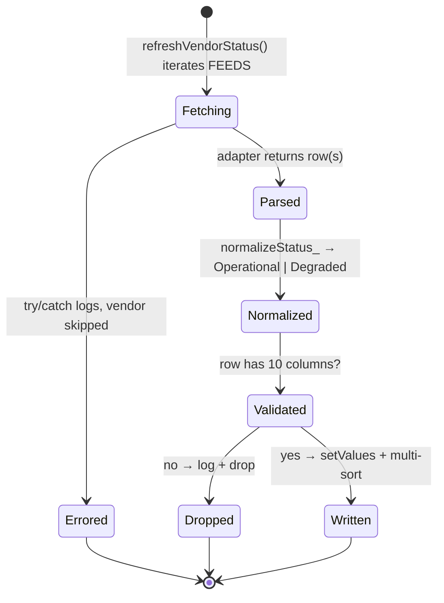

# Vendor Status Dashboard

[](https://github.com/bjgreenberg/vendor-dashboard/actions/workflows/ci.yml)
[](https://github.com/bjgreenberg/vendor-dashboard/releases)
[](LICENSE)

Last updated: 2026-07-05 02:13 PM CDT

A Google Apps Script / Node.js project that monitors the live status of a SaaS
vendor ecosystem by polling each vendor's public status API and writing the
results to a Google Sheet.

> **Note on badges:** the repository is currently private, so the CI and Release
> badges render their status only to authenticated collaborators; they become
> universally visible when the repository is made public. See
> [Going public](#going-public) for the remaining open-source steps (adds an
> OpenSSF Scorecard badge).

## Purpose

Provides a single-pane view of operational health across 30+ vendors. The set of
vendors is fully configurable — see [Configuring vendors](#configuring-vendors).
The default `FEEDS` map ships a broad, working example set (1Password, Alteryx,
Apple, Calendly, Celigo, Cloudflare, Concur, Docusign, Freshdesk/Freshservice,
GitHub, Google Workspace, HubSpot, Jamf, KnowBe4, Microsoft, Monday.com, Okta,
Seismic, Zoom, and more), all of which expose public status endpoints.

## How it works

A time-based Apps Script trigger runs `refreshVendorStatus()`, which polls each
vendor in `FEEDS` and writes a normalized row set to the sheet. Most vendors
expose a standard **Statuspage v2** summary, parsed by one generic adapter
(`fetchStatuspageSummary_`, with an optional `FILTERS` component allowlist);
vendors that don't (Google, Microsoft, Apple, Concur, Tableau/Salesforce, Okta
RSS, SorryApp, Stormboard, StatusGator-scraped) get their own adapter. **Every
adapter call is wrapped in its own `try/catch`**, so one vendor's outage or API
change degrades that one row, never the whole run.


### Lifecycle of a single vendor row

Each vendor is processed independently; the diagram below traces one vendor
through a refresh. A fetch/parse error is isolated to that vendor (the row is
skipped), and a row that doesn't match the 10-column schema is dropped rather
than written.



### Output schema (data dictionary)

Each refresh clears the data rows and rewrites them. Every row has exactly these
10 columns, in order (`HEADERS` in `Code.js`); a row that doesn't match is
dropped:

| Column | Meaning |
|--------|---------|
| `vendor` | Vendor name (the `FEEDS` key). |
| `service` | Component/service within the vendor, or the vendor itself when no sub-component is reported. |
| `status` | Normalized to **`Operational`** or **`Degraded`** by `normalizeStatus_`. |
| `incident_name` | Title of the active incident, if any. |
| `description` | Cleaned incident description text. |
| `impact` | Vendor-reported impact level (e.g. `minor`, `major`, `critical`). |
| `started_at` | Incident start timestamp, when provided. |
| `updated_at` | Incident last-updated timestamp, when provided. |
| `source_url` | The status endpoint the row was derived from. |
| `last_checked` | ISO timestamp of this refresh run. |

## Tech Stack

- **Runtime:** Google Apps Script (V8)
- **Output:** Google Sheets (`Vendor System Status` tab)
- **Status sources:** Statuspage v2 API, StatusGator scraping, vendor-specific APIs
- **Dev tooling:** `@types/google-apps-script` for IDE type support

## Prerequisites

- Google Workspace account with Apps Script access
- [clasp](https://github.com/google/clasp) for local development (`npm install -g @google/clasp`)
- Node.js (for type checking / dev tooling only — not used at runtime)

## Setup

1. Clone the repo and install dev dependencies:
   ```bash
   git clone https://github.com/bjgreenberg/vendor-dashboard.git
   cd vendor-dashboard
   npm install
   ```
2. Authenticate clasp:
   ```bash
   clasp login
   ```
3. Link to your Apps Script project:
   ```bash
   clasp clone <scriptId>
   # or push to an existing project:
   clasp push
   ```
4. In Apps Script → Project Settings, confirm the script is bound to the correct Google Sheet.
5. Set up a time-based trigger to run `refreshVendorStatus` on your desired schedule (e.g. every 15 minutes). _(This is the single entry point — see [How it works](#how-it-works).)_

## Configuring vendors

The vendor list lives in the `FEEDS` map at the top of `Code.js` — a `"Vendor
Name": "https://status-endpoint"` object. To adapt the dashboard to your own
stack:

- **Add a vendor** that exposes a Statuspage v2 summary (`…/api/v2/summary.json`):
  add one line to `FEEDS`. The generic `fetchStatuspageSummary_` adapter handles it.
- **Narrow the components** reported for a noisy vendor: add an allowlist entry to
  `FILTERS` (e.g. `"Cloudflare": ["Dashboard", "DNS", "Workers"]`).
- **Add a non-Statuspage vendor** (custom JSON, RSS, or scraped): follow the
  existing per-vendor adapters (`fetchGoogleAppsStatus_`, `fetchMicrosoftStatus_`,
  `fetchAppleStatus_`, `fetchStatusGator_`, …) as templates and wire the call into
  `refreshVendorStatus()` inside its own `try/catch`.

## Secrets

No API keys are hardcoded. Any credentials required by specific vendor APIs should
be stored in Apps Script **Script Properties** (Project Settings → Script
Properties), not in source code.

## Project Structure

| File | Purpose |
|------|---------|
| `Code.js` | Main script — `FEEDS`/`FILTERS`/`HEADERS` config, the `refreshVendorStatus()` entry point, and all per-vendor fetch/parse adapters |
| `appsscript.json` | Apps Script manifest |
| `package.json` / `package-lock.json` | Dev dependencies (`@types/google-apps-script`) + project metadata |
| `LICENSE` | Apache-2.0 license text |
| `CITATION.cff` | Machine-readable citation metadata (powers GitHub's "Cite this repository") |
| `CHANGELOG.md` | Keep a Changelog history |
| `release-please-config.json` / `.release-please-manifest.json` | Release automation config (see [Versioning & releases](#versioning--releases)) |
| `.github/workflows/` | `ci.yml` (syntax + audit + docs-render), `release-please.yml` |
| `.github/dependabot.yml` | Weekly npm + github-actions update PRs |
| `scripts/render-diagrams.sh` | Render-checks every Mermaid block (the `docs-render` gate) |
| `.gitignore` | Excludes `node_modules/`, `.clasp.json`, `creds.json`, `AGENTS.md` |

## Versioning & releases

Releases are automated with
[release-please](https://github.com/googleapis/release-please). On every push to
`main` the `release-please` workflow reads the
[Conventional Commits](https://www.conventionalcommits.org/) since the last
release and maintains a **release PR** that:

- bumps the version in `package.json` and `CITATION.cff`, and
- prepends the new version section to `CHANGELOG.md`.

Merging that release PR tags the version and publishes a **GitHub Release** with
generated notes — the version then appears on the repository's Releases panel and
in the Release badge above. Versions are never hand-tagged.

Commit types drive the bump: `feat:` → minor, `fix:` → patch, `feat!:`/`BREAKING
CHANGE:` → major. `docs:`, `chore:`, `ci:`, etc. do not cut a release on their own.

## Citing this project

Citation metadata lives in [`CITATION.cff`](CITATION.cff); the version and
release date are kept current by release-please, so they never drift from the
tagged release. On GitHub, use **"Cite this repository"** (right sidebar) to
export APA/BibTeX.

## Contributing

`main` is protected — all changes go **branch → PR → squash-merge**, with the
`test` and `docs-render` CI checks required. Use Conventional Commit messages so
release automation can classify the change. Before opening a PR, run the diagram
render-check locally:

```bash
scripts/render-diagrams.sh
```

## CI

Every pull request, and every push to `main`, runs the `test` job of the CI
workflow ([.github/workflows/ci.yml](.github/workflows/ci.yml)):

- `node --check` on every tracked `.js` file (syntax gate — Apps Script code
  has no unit tests yet)
- `npm audit --audit-level=high` against the committed lockfile
- `docs-render` — renders every Mermaid diagram in the repo's Markdown via the
  digest-pinned `mermaid-cli` container (`scripts/render-diagrams.sh`), so an
  unrenderable diagram can't merge

Separately, the `release-please` workflow
([.github/workflows/release-please.yml](.github/workflows/release-please.yml))
runs on pushes to `main` to maintain the release PR.

## Branch protection

PR flow per senior-engineering-partner: `main` is protected — changes go
branch → PR → merge. The `test` and `docs-render` CI checks are required: PRs
cannot merge until they pass. Linear history, enforced for admins.

## Going public

This repository is being generalized from an internal tool into a public
open-source project. When it is flipped to public, complete the open-source
posture:

- Add an [OpenSSF Scorecard](https://github.com/ossf/scorecard-action) workflow
  and its badge (the action requires a public repo).
- Enable Dependabot **alerts + security updates** and **secret scanning + push
  protection** in repository settings (the committed `dependabot.yml` handles
  version-update PRs).
- Confirm the CI and Release badges render for anonymous visitors.

## License

Licensed under the [Apache License 2.0](LICENSE).
