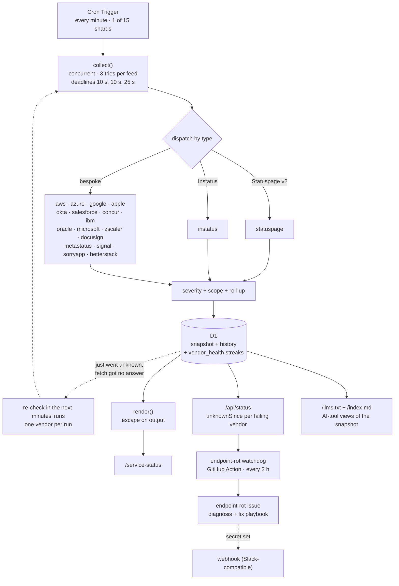
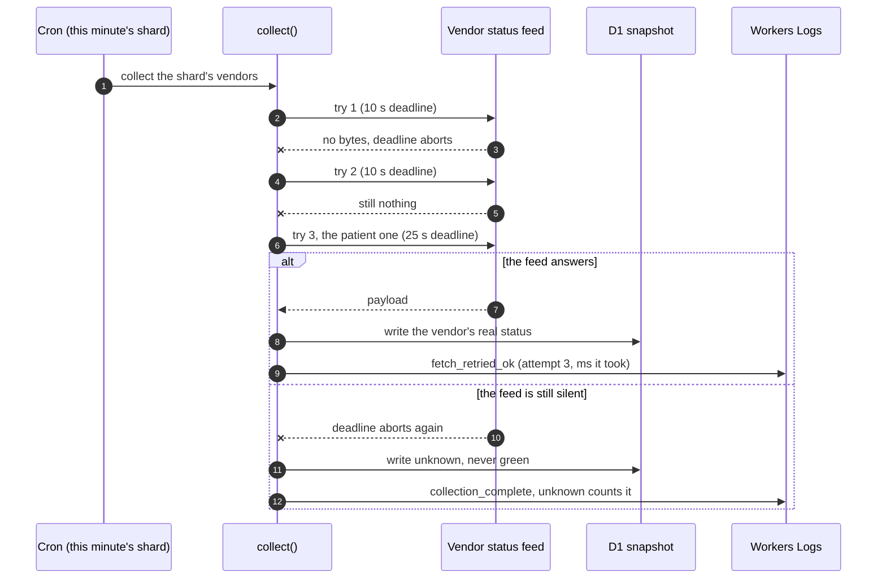
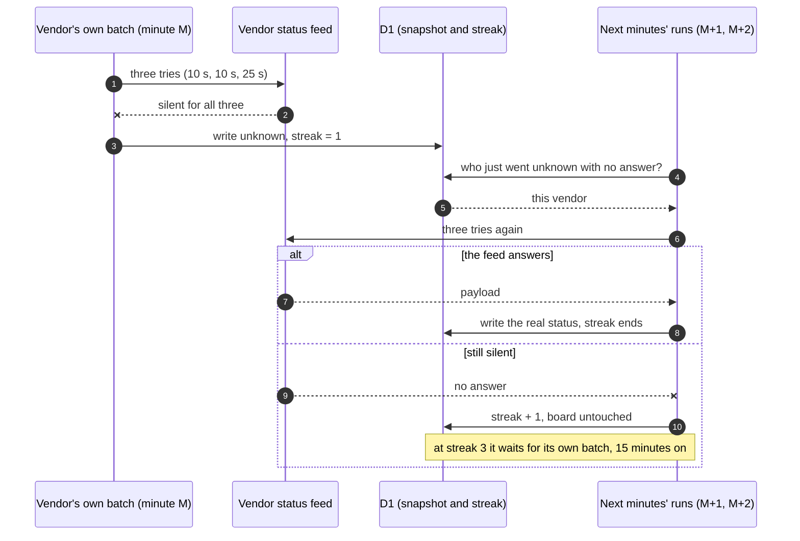
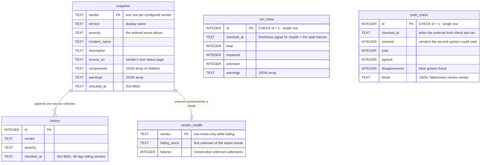

# Vendor Status Dashboard

[](LICENSE)
[](https://github.com/bjgreenberg/vendor-dashboard/releases)
[](https://github.com/bjgreenberg/vendor-dashboard/actions/workflows/test.yml)
[](https://github.com/bjgreenberg/vendor-dashboard/actions/workflows/lint.yml)
[](https://github.com/bjgreenberg/vendor-dashboard/actions/workflows/perf.yml)
[](https://github.com/bjgreenberg/vendor-dashboard/actions/workflows/docs-render.yml)
[](https://github.com/bjgreenberg/vendor-dashboard/actions/workflows/cff-validate.yml)
[](https://github.com/bjgreenberg/vendor-dashboard/actions/workflows/secret-scan.yml)
[](https://scorecard.dev/viewer/?uri=github.com/bjgreenberg/vendor-dashboard)
[](https://www.bestpractices.dev/projects/13942)
[](https://www.conventionalcommits.org/en/v1.0.0/)

Last updated: 2026-10-02 08:21 AM CDT

Monitors the live operational status of a configurable set of SaaS and cloud
services by polling each vendor's own public status endpoint, and serves a
single-pane dashboard. Runs as a Cloudflare Worker; every vendor is
re-checked on a 15-minute cycle.

Live at **<https://briangreenberg.net/service-status>**.

> **What this repo is:** a working reference implementation, wired to
> briangreenberg.net — the dashboard reuses that site's chrome, stylesheet and
> theme keys (`src/worker/render.js`). To run your own: fork, replace
> [`config/vendors.json`](config/vendors.json) with your vendor set, swap the
> header/footer markup, and deploy. The engine (`src/engine/`) is deliberately
> runtime-agnostic and does not know Cloudflare exists.

## Contents

- [Why it exists](#why-it-exists)
- [How it works](#how-it-works)
- [Configuring vendors](#configuring-vendors)
- [Project structure](#project-structure)
- [Development](#development)
- [Deployment](#deployment)
- [Monitoring](#monitoring)
- [CI gates](#ci-gates)
- [Design decisions](#design-decisions)
- [Known limitations](#known-limitations)
- [Troubleshooting](#troubleshooting)
- [Going public](#going-public)
- [License](#license)

## Why it exists

A status board is only worth having if you can trust it. The predecessor to this
tool — a single-file Google Apps Script — was audited in July 2026 and found to
have **four independent sources of false green**: vendors that displayed
"Operational" regardless of reality.

| Finding | Vendor | Mechanism |
|---|---|---|
| H1 | Microsoft | fetched the endpoint, discarded the result, returned a hardcoded literal |
| H6 | Stormboard | vendor moved to Better Stack; a bare `/\boperational\b/` matched its markup |
| H7 | Concur | vendor became a JS app; the scraped strings vanished and the sanity guard was defeated by the page `<title>` |
| H4 | Concur, others | a network error returned a row whose status column read `Operational` |

The common cause was not any single bug: it was the absence of any test
asserting an adapter's output against a recorded payload. Every one of those
would have failed red on the first fixture-pinned assertion.

The full report is in [`docs/audit/`](docs/audit/). Its findings are the
acceptance criteria for this rewrite, and the fixes are pinned by tests.

**The governing rule: an unverifiable status is `unknown`, never `operational`.**
Failing closed is the whole point.

## How it works

A Cron Trigger fires **every minute** and collects one of **15 shards**, so
each vendor is still re-checked every 15 minutes (`shards × interval` is the
refresh promise; sharding was forced by the free plan's 50-subrequest and
10 ms CPU ceilings and retained after the 2026-08-02 move to Workers Paid —
tiny invocations and per-vendor blast-radius isolation are worth keeping).
The Worker fetches its shard's vendors concurrently,
normalizes each response into a common record, writes a snapshot
transactionally to D1, and serves a rendered dashboard.


```mermaid
flowchart TB
    cron["Cron Trigger<br/>every minute · 1 of 15 shards"] --> collect["collect()<br/>concurrent · 3 tries per feed<br/>deadlines 10 s, 10 s, 25 s"]
    collect --> adapters{"dispatch by type"}
    adapters -->|"Statuspage v2"| a1["statuspage"]
    adapters -->|"Instatus"| a2["instatus"]
    adapters -->|"bespoke"| a3["aws · azure · google · apple<br/>okta · salesforce · concur · ibm<br/>oracle · microsoft · zscaler · docusign<br/>metastatus · signal · sorryapp · betterstack"]
    a1 --> norm["severity + scope + roll-up"]
    a2 --> norm
    a3 --> norm
    norm --> d1[("D1<br/>snapshot + history<br/>+ vendor_health streaks")]
    d1 -.->|"just went unknown,<br/>fetch got no answer"| again["re-check in the next minutes' runs<br/>one vendor per run"]
    again -.-> collect
    d1 --> render["render()<br/>escape on output"]
    render --> page["/service-status"]
    d1 --> api["/api/status<br/>unknownSince per failing vendor"]
    d1 --> ai["/llms.txt + /index.md<br/>AI-tool views of the snapshot"]
    api --> wd["endpoint-rot watchdog<br/>GitHub Action · every 2 h"]
    wd --> issue["endpoint-rot issue<br/>diagnosis + fix playbook"]
    issue -.->|"secret set"| slack["webhook (Slack-compatible)"]
```

### When a status feed stalls

A status feed sometimes accepts the request and then sends nothing. One stall
was measured on 2026-10-01 against Atlassian Statuspage: 0 bytes for 15
seconds, then 0.07 seconds on the next request. In production all three
10-second tries aborted, and the vendor sat on the board as `unknown` for a
full 15-minute cycle. In the 14 days before, 250 of the 283 `unknown` checks
were Statuspage vendors.

So the **last of the three tries waits 25 seconds** instead of 10 (2.5 times
the normal deadline). No new kind of request is sent: it is the same three
tries. The run-wide retry budget went from 10 to 20 so that every feed in the
largest shard (eight feeds) can reach its third try when they stall together,
which is how Statuspage stalls arrive.

> [!IMPORTANT]
> This does not weaken the governing rule. A row is green only when a real
> fetch returned a payload the adapter verified. A feed that outlasts the last
> try is still written `unknown`.


```mermaid
sequenceDiagram
    autonumber
    participant C as Cron (this minute's shard)
    participant E as collect()
    participant V as Vendor status feed
    participant D as D1 snapshot
    participant L as Workers Logs

    C->>E: collect the shard's vendors
    E->>V: try 1 (10 s deadline)
    V--xE: no bytes, deadline aborts
    E->>V: try 2 (10 s deadline)
    V--xE: still nothing
    E->>V: try 3, the patient one (25 s deadline)
    alt the feed answers
        V-->>E: payload
        E->>D: write the vendor's real status
        E->>L: fetch_retried_ok (attempt 3, ms it took)
    else the feed is still silent
        V--xE: deadline aborts again
        E->>D: write unknown, never green
        E->>L: collection_complete, unknown counts it
    end
```

| What | Before 2026-10-01 | Now |
|---|---|---|
| Tries per feed | 3 | 3 |
| Deadlines | 10 s, 10 s, 10 s | 10 s, 10 s, 25 s |
| Longest wait on one dead feed | about 31 s | about 46 s |
| Retry budget per run | 10 | 20 |
| Most requests in the largest shard, all eight feeds dead | 18 | 24 (the subrequest budget is 40) |

> [!NOTE]
> Why all three 10-second tries failed is not established. Either a stall
> outlasts the 31 seconds the tries span, or each request waits on a slow
> origin of its own. A patient last try covers both, up to about 46 seconds
> from the first request. A first design added a fourth request after the
> three; two review passes on PR #158 showed it was more machinery for the
> same patience, and it was dropped.

Each fetch that failed at least once and then answered logs one
`fetch_retried_ok` line: the URL, which try answered (`attempt`), and how long
that try took (`ms`). It is written before the D1 write, so a failed write
does not lose it. `attempt: 3` with `ms` over 10,000 is the patient try
catching a stall, and those `ms` values are the only record of how long real
stalls last. `attempt: 2` is an ordinary retry. `retried_ok` on
`collection_complete` is the count.

#### Then the next minutes look again

The patient last try cut `unknown` checks from 0.41% to 0.06% in its first 16
hours (2 of 3,451). The two that got through were stalls longer than 46
seconds, and each left its vendor on the board as `unknown` until its batch
came round again, 15 minutes later, although the feed was answering again
within a minute or two.

So every run, after its own batch, also looks again at **one** vendor that
has only just gone `unknown` because its fetch got no answer, whichever batch
that vendor belongs to.

> [!IMPORTANT]
> A re-check may only **improve** a row. If the vendor answers, its real status
> is written. If it fails again, nothing on the board changes: one more failure
> is counted and that is all. `unknown` is never written by a re-check, so a
> slow failing one cannot undo the green that a quicker one just wrote.


```mermaid
sequenceDiagram
    autonumber
    participant B as Vendor's own batch (minute M)
    participant V as Vendor status feed
    participant D as D1 (snapshot and streak)
    participant N as Next minutes' runs (M+1, M+2)

    B->>V: three tries (10 s, 10 s, 25 s)
    V--xB: silent for all three
    B->>D: write unknown, streak = 1
    N->>D: who just went unknown with no answer?
    D-->>N: this vendor
    N->>V: three tries again
    alt the feed answers
        V-->>N: payload
        N->>D: write the real status, streak ends
    else still silent
        V--xN: no answer
        N->>D: streak + 1, board untouched
        Note over N,D: at streak 3 it waits for its own batch, 15 minutes on
    end
```

| Rule | Value | Why |
|---|---|---|
| Who is re-checked | A vendor whose row is `unknown` with a `fetch failed: …` reason and a streak of 1 or 2 | A network error or a deadline can be waited out. A 429, a 404 or a payload that did not parse cannot, and a run that ran out of our own budget was not the vendor's fault |
| How many extra looks | Two per outage | A vendor that is really down costs two extra checks, then waits for its normal turn |
| How many per run | One, fewest failures first, then longest-failing | One vendor has the whole budget and all six connections to itself. Several unknown at once are served one a minute, each getting a first look before any gets a second |
| When in the run | After the batch has been written | A Worker holds six outgoing connections; a stalled re-check beside the batch could make healthy feeds time out |
| What a failed re-check writes | One more failure on the streak. No snapshot row, no history row | It learned nothing new, and writing `unknown` again is how one re-check could undo another |
| If the re-check itself breaks | `collection_alert` / `recheck_failed`; the batch is unaffected | A re-check is a bonus |

`vendor_health.failures` therefore counts every failed look in a streak,
re-checks included; it is no longer "failed 15-minute checks". `failing_since`,
which the endpoint-rot watchdog reads, is untouched. The `history` table gains
one row per recovery (the status the re-check read) and none for a failed
re-check, so the `unknown` rate computed from it stays comparable with earlier
days. Each re-check logs `recheck_complete` with the `vendor` and an `outcome`
of `recovered`, `still_unknown` or `not_checked` (our own budget ran out; that
also raises `subrequest_budget_exhausted`).

Known gaps:

- The extra documents some vendors need after the first one (Concur's
  per-data-centre files, Zscaler's per-cloud files) are fetched once each with
  the 10-second deadline.
- "About 46 seconds" is for a vendor with one URL. A vendor with many extra
  documents could already run past the one-minute cron when they stall, and
  now runs 15 seconds longer. When two runs overlap, the older one can write
  last and step "last collection" back by a minute until the next run.
- With a `fallbackUrls` entry, each URL gets the full 10, 10, 25 schedule in
  turn. No vendor in `config/vendors.json` uses a fallback today.
- A vendor is `unknown` on the board from the moment its batch gives up until
  a re-check reads it: usually one to two minutes, not zero. With several
  vendors unknown at once, the last waits a minute per vendor ahead of it.
- When a batch is itself slow, two consecutive minutes can re-check the same
  vendor at once. That wastes a look and nothing else: neither can write
  `unknown`, and neither can write green without a verified payload.
- A re-check that runs out of subrequest budget counts no failure, so it is
  tried again each minute while the alert fires. One vendor has never needed
  more than 15 of the 40.

### Endpoints

| Path (under `/service-status`) | Type | What it is |
|---|---|---|
| `/` | HTML | The board |
| `/api/status` | JSON | Every vendor record plus the truth-check stamp |
| `/health` | JSON | Freshness probe; 503 once the snapshot is older than 45 minutes |
| `/llms.txt` | text/plain | An [llms.txt](https://llmstxt.org) for this subpath: what the board is, how it decides, its endpoints, and every vendor with its live state and status page. Pure ASCII. (2026-09-30, worklist #127) |
| `/index.md` | text/markdown | The llms.txt spec's clean-Markdown copy of the page: a status table. The HTML page links it with `<link rel="alternate" type="text/markdown">`. (2026-09-30) |
| `/ai-fetches.json` | JSON | Who fetched `/llms.txt` and `/index.md`: per-day counts by crawler (GPTBot, ClaudeBot, PerplexityBot, ... or browser/other) for the last 30 days, aggregates only. Counted by `src/worker/ai-fetches.js` (shared with the three sites) into table `ai_fetches` (migration 0004), one atomic UPSERT per fetch, 90-day retention. (2026-09-30, worklist #127) |
| `/api/truth-check` | POST | The truth check's stamp (bearer token) |

The two AI-tool views render from the same snapshot as the page (`src/worker/llms.js`), so their vendor list and counts
cannot drift from the board.

**Severity** is an ordered enum, not a boolean:

```
major_outage > partial_outage > degraded > unknown > maintenance > operational
```

`unknown` deliberately outranks `operational` — a check that failed is not
evidence of health — and sits below `maintenance` in urgency terms only because
planned maintenance is a *known* benign state.

**How a vendor's status is decided:**

- **With a scope configured** — severity is the worst of the *in-scope
  components only*. The vendor's own page indicator is ignored, because the
  operator has declared what they care about.
- **Without a scope** — severity is the worst of the page indicator and all
  components (in group mode, the groups). The indicator votes here even in
  group mode: a vendor can hang a page-wide maintenance on an ungrouped
  third-party leaf while every product group stays operational, which is how
  QuantumWorkplace rendered Operational beside "Service Under Maintenance"
  until the truth check caught it (2026-09-21).
- **Incidents never contribute to severity**, only to context. Deriving status
  from incidents alone caused errors in both directions in the predecessor.
  Two bespoke adapters are the deliberate exceptions, each because the vendor
  publishes no trustworthy component state: Zscaler's per-service boolean stayed
  `true` through an open degradation, so its *active-event list* is the vote;
  Docusign's `components.json` is the vote, but an *active* incident on its
  second document votes too — the two feeds are both the vendor's word, and
  when they disagree the worse one wins. Resolved incidents never vote anywhere.
- **The board judges from a US vantage point, and the page says so.** For
  vendors publishing per-region status, `scope` picks the US components that
  vote on severity, while `componentLevel: 'group'` keeps the card showing the
  vendor's service groups with non-US trouble as detail: it informs, but it
  does not vote. Scope and group mode compose (applied to OutSystems, and to AWS via region-code
  prefixes in its bespoke adapter);
  a scope that matches nothing live fails closed to `unknown`, because an
  empty selection is not health.

**Roll-up:** a vendor is a parent over many sub-services. All healthy renders one
collapsed row; anything unhealthy renders the parent plus **only** the affected
children. Zoom publishes 283 components — you should never see 283 green rows.

### Data model


```mermaid
erDiagram
    snapshot {
        TEXT vendor PK "one row per configured vendor"
        TEXT service "display name"
        TEXT severity "the ordered enum above"
        TEXT incident_name
        TEXT description
        TEXT source_url "vendor's own status page"
        TEXT components "JSON array of children"
        TEXT warnings "JSON array"
        TEXT checked_at "ISO-8601"
    }
    history {
        INTEGER id PK
        TEXT vendor
        TEXT severity
        TEXT checked_at "ISO-8601; 90-day rolling window"
    }
    run_meta {
        INTEGER id PK "CHECK id = 1 - single row"
        TEXT checked_at "freshness signal for /health + the stale banner"
        INTEGER total
        INTEGER impacted
        INTEGER unknown
        TEXT warnings "JSON array"
    }
    vendor_health {
        TEXT vendor PK "row exists only while failing"
        TEXT failing_since "first unknown of the active streak"
        INTEGER failures "consecutive unknown collections"
    }
    truth_check {
        INTEGER id PK "CHECK id = 1 - single row"
        TEXT checked_at "when the external truth check last ran"
        INTEGER covered "vendors the second opinion could read"
        INTEGER total
        INTEGER agreed
        INTEGER disagreements "false greens found"
        TEXT detail "JSON: falseGreen vendor names"
    }
    snapshot ||--o{ history : "appends one row per collection"
    snapshot ||--o| vendor_health : "unknown starts/extends a streak"
```

`snapshot` is the current board, replaced per-shard inside one transaction so a
reader never sees a half-written board. `history` is a 90-day rolling window
(pruned in the same write batch) for uptime/MTTR analysis. `run_meta` is the
single-row freshness record that `/health`, the stale banner, and the external
dead-man monitor all read. `vendor_health` tracks consecutive-`unknown`
streaks per vendor for the [endpoint-rot watchdog](#monitoring) — written in
the same transactional batch, skipped on budget-exhausted runs (operator
fault, not vendor rot), surfaced as `unknownSince` on `/api/status`.
`truth_check` is the single-row stamp the external [truth check](#monitoring)
writes through `POST /api/truth-check` (bearer-token gated) and the board
renders under the collection line — absent means never checked, older than
three hours means overdue.

## Configuring vendors

The monitored set lives entirely in [`config/vendors.json`](config/vendors.json).
**No vendor list exists in source code.** That separation is what lets one
codebase serve different deployments with different configs.

```jsonc
{
  "name": "Cloudflare",
  "type": "statuspage",
  "url": "https://www.cloudflarestatus.com/api/v2/summary.json",
  "scope": { "groups": ["Cloudflare Sites and Services"] }
}
```

| Field | Purpose |
|---|---|
| `type` | Which adapter parses the feed (see the file's own `$comment`) |
| `url` | The status endpoint |
| `scope` | Optional. Restrict which components count, by `groups` or exact `components` names |
| `scope.regionGroups` | Optional. `{ "GroupName": ["US East", …] }` — for a group whose leaves are geographies, only the listed ones vote on severity. The rest display (prefixed with the group name) but do not vote, per the US vantage point |
| `dataCenters` | Concur only — restrict to named data centres |
| `bannerUrl` | Concur only — its secondary "something is wrong" signal |
| `incidentsUrl` | Docusign only — health.docusign.com keeps its incident list on a second document; advisory, an active incident votes and supplies the card text |

**Scoping matters more than it looks.** Cloudflare publishes ~470 components,
most of them edge PoPs. Without a scope, routine re-routing in Arica or Guam —
the redundancy working as designed — drags the row amber. Measured 2026-07-30:
unscoped 46 non-operational, services-only 0.

If a configured component name matches nothing in the live payload, the run
emits a warning rather than silently ignoring it.

## Project structure

| Path | Purpose |
|---|---|
| `src/engine/` | **Runtime-agnostic.** Pure functions, no platform APIs. Testable in plain Node |
| `src/engine/adapters/` | One module per feed format |
| `src/engine/severity.js` | Ordered enum, vendor-vocabulary normalization |
| `src/engine/scope.js` | Component/group allowlist + drift detection |
| `src/engine/rollup.js` | Parent roll-up and progressive disclosure |
| `src/engine/collect.js` | Orchestrator: concurrency, deadlines (the last try is patient), bounded retry |
| `src/worker/` | Cloudflare bindings **only** — `scheduled()`, `fetch()`, D1, rendering |
| `src/worker/site-assets.js` | Content-hashes the site's `site.css`, `theme.js` and `consent.js` (md5, first 10 hex, as the site's build does) so the page links the same `?v=` URLs as the site; 5-minute isolate cache, plain links as the fallback |
| `config/` | Vendor configuration |
| `migrations/` | D1 schema as ordered migrations (`wrangler d1 migrations apply`) |
| `test/fixtures/` | Recorded vendor payloads (golden fixtures) |
| `scripts/truth-check/` | The truth check: `rules.mjs` (pure second-opinion rules, fixture-tested) + `run.mjs` (the network half the workflow drives) |
| `scripts/watchdog/` | The endpoint-rot watchdog: `classify.mjs` (pure) + `diagnose-endpoint.mjs` (probes) |
| `scripts/logo-manifest.mjs` | Pure manifest reconciliation for `fetch-logos.mjs`: a refused download never shrinks the manifest |
| `docs/audit/` | The extraction audit driving this rewrite |

The engine deliberately contains **no** Worker, GCP, or Apps Script APIs. The
caller injects `fetchFn` and `now`, which is what makes it testable without a
network and portable to another runtime.

## Development

```bash
npm ci
node scripts/fetch-logos.mjs   # regenerate vendor marks (build artifact — see below)
npm test                       # full unit suite (runs in ~1 s)
npm run test:watch
npx wrangler dev               # local Worker
```

**Vendor marks are a build artifact, not repo content.** Serving each vendor's
own favicon on the dashboard is ordinary nominative use; *redistributing* 46
trademarked marks in a public repository is a different act, so the icon
directories are gitignored. `fetch-logos.mjs` downloads each vendor's declared
favicon (magic-byte validated — a bot wall's challenge page is refused), mirrors
it into the served `public/` directory, and regenerates
[`config/logos.json`](config/logos.json). The manifest *is* tracked because the
renderer imports it at build time; on a clone that has never run the script,
the icon test gates skip loudly and rows fall back to their status dots.

Tests run against recorded fixtures — no network required, and deterministic
because the clock is injected.

## Deployment

```bash
npm run deploy   # fetch-logos → d1 migrations apply → wrangler deploy
```

Requires `wrangler login` (OAuth) or `CLOUDFLARE_API_TOKEN`. The script order
matters: logos first (deploy uploads whatever is in the gitignored `public/`
icons dir — without this step the board ships without vendor marks), then
migrations (idempotent; D1 tracks applied ones), then the Worker itself.

### Deploy your own

[](https://deploy.workers.cloudflare.com/?url=https://github.com/bjgreenberg/vendor-dashboard)

One click forks this repo into your own GitHub and Cloudflare accounts,
provisions a fresh D1 database from the Wrangler config, and runs `npm run
deploy` — migrations and vendor logos included. (The button works once this
repository is public.) Then make it yours:

1. Replace [`config/vendors.json`](config/vendors.json) with your vendor set
   (each entry's `brandDomain` is what the logo fetcher uses; an entry may
   declare `iconUrl` to override favicon discovery with an explicit image).
2. **Delete or repoint the `routes` block in `wrangler.jsonc`** — it binds to
   briangreenberg.net, which is not your zone. Your deployment serves on your
   `*.workers.dev` subdomain immediately (`BASE_PATH` handles both mounts).
3. Swap the site chrome in `src/worker/render.js` (header, footer, share bar)
   for your own, and point `SITE_ORIGIN` / `SITE_ASSETS` in
   `src/worker/site-assets.js` at your site's stylesheet and scripts (or
   leave them: off the canonical host the page uses plain links).
4. Optional: enable the truth-check stamp — generate a random token, set it
   as the Worker secret (`npx wrangler secret put TRUTH_CHECK_TOKEN`) and as
   the Actions secret of the same name (see [Monitoring](#monitoring)).

Routing is declared in [`wrangler.jsonc`](wrangler.jsonc) as a **route**, not a
Custom Domain. `briangreenberg.net` is itself a Custom Domain bound to a
different Worker; a route on a sub-path runs *before* the Custom Domain Worker,
so `/service-status*` is intercepted and every other path reaches the site
untouched.

> ⚠️ **Never declare `custom_domain` in `wrangler.jsonc`.** Wrangler skips the
> changeset preview and force-overrides DNS whenever stdout is not a TTY (CI,
> agent shells) — on a zone a live site depends on. A plain route does not touch
> DNS.

⚠️ **Deploys take 20–30 seconds to propagate.** Testing sooner produces
convincing false failures — 404s on paths that are configured correctly.
Cache-busting does not help, because it is not caching.

## Monitoring

Three independent monitors, all running *outside* Cloudflare (an alert
inside a dying invocation dies with it). Two are GitHub-cron based; the
truth check runs on the always-on Mac first and on GitHub as a backstop
(see [Where the truth check runs](#where-the-truth-check-runs)):

- **Dead-man monitor** (`.github/workflows/staleness-monitor.yml`, every
  15 min) watches **whole-board freshness**: `/health` answers 503 when the
  newest snapshot is stale or D1 is unreachable, and a failed run emails the
  repo owner. It probes the `workers.dev` origin because Cloudflare bot
  management challenges GitHub's runners on the public hostname.
- **Endpoint-rot watchdog** (`.github/workflows/endpoint-rot-watchdog.yml`,
  every 2 h) watches **individual vendors**: when one has been `unknown`
  continuously for 6+ hours (`unknownSince` on `/api/status`, streak-tracked
  in D1), it probes the endpoint (DNS chain, TLS certificate identity,
  redirect walk, body sniff), classifies the failure — certificate mismatch,
  decommissioned page, moved-but-redirecting, 4xx/5xx, payload reshape, or
  "endpoint fine, our adapter drifted" — and files an issue labeled
  `endpoint-rot` with the evidence and a per-class fix playbook. When the
  vendor recovers, the watchdog comments and closes the issue. The SendGrid
  rot of 2026-08-12 (a decommissioned custom domain serving a
  `*.statuspage.io` certificate) is the class of failure it automates away.
- **Truth check** (`.github/workflows/truth-check.yml`, every 2 h) is the
  only one that checks the **claim** rather than the plumbing: *we render
  operational — does the vendor agree?* By a different code path from the
  adapters (`scripts/truth-check/rules.mjs`), it reads each covered vendor's
  own verdict the simplest way that vendor offers — the Statuspage page
  indicator, the in-scope component states for a scoped vendor, `page.status`
  on Instatus, `page.state` on SorryApp, Oracle's page-level `status.json`,
  and for Google an incident with no `end` time — and, since 2026-09-30
  (`scripts/truth-check/vendor-rules.mjs`, worklist #124), the other 13
  platforms too, each preferring a different field from its adapter: Apple's
  event start/end times, AWS's numeric event `status` (US regions only, as
  on the board), IBM's parsed `statusItems`, Okta's embedded incident
  records, Stormboard's page heading, Signal's status symbol, Zscaler's
  legend `visible` flag per cloud, Concur per data centre, Docusign
  components plus open incidents, Meta's exact status words, Tableau's
  active production instances, Discord through the same US voice-region
  lens as the board, and Microsoft source by source. It compares that with
  `/api/status`. A **false green** (board `operational`, vendor says
  otherwise) that survives a ten-minute recheck — the board re-collects
  each vendor every 15 minutes, so a fresh outage reads as false green until
  its shard runs — files an issue labeled `truth-check` with the raw evidence and
  what the board rendered, fails that one run so the owner gets one email,
  and closes the issue when they agree again; "over-cautious" rows (board
  says trouble, vendor says fine) are reported, never paged. Open incidents
  on Statuspage vendors are evidence, not a vote — the settled decision that
  incidents inform context and never severity holds here too. Platforms the
  rule does not understand are counted as **uncovered**, never guessed (36 of
  49 covered on 2026-09-05; **49 of 49** since 2026-09-30, and a test fails
  if a configured vendor has no reader). The workflow then **stamps the
  board**: "Double-checked ‹time› against 49 of 49 vendors' own status feeds
  · no disagreements." If a vendor is ever uncovered again, the stamp adds
  "The other N publish their status in formats this check can't read yet;
  the board still reads them." with a collapsible "Which N?" list (the stamp
  carries their names since 2026-09-30, so "36 of 49" never read as vendors
  gone missing). It goes overdue after three hours — a stale stamp is itself the alarm. The 2026-08-28 Google misreport (an open Chat incident rendered as
  all healthy, PR #123) is the class of failure it exists to catch.

### Where the truth check runs

Since 2026-09-25 the truth check has **two runners executing one script**,
`scripts/truth-check/check.sh` (compare → confirm → issues → stamp; exit `3`
means "a NEW disagreement was filed", any other non-zero is the check itself
failing), so they cannot drift:

| Runner | Cadence | Role | Secrets |
|---|---|---|---|
| **hume** (the always-on Mac), `com.briangreenberg.vendor-dashboard-truth-check` via `scripts/truth-check/hume.sh` | hourly at :11 | **primary** — an exact schedule, watched by health-monitor's dead man's switch (stamp `~/.local/state/vendor-dashboard-truth-check/last-success`, log `~/Library/Logs/vendor-dashboard-truth-check.log`, 1 MiB cap) | login-keychain items `vendor-dashboard-truth-check-pat` (fine-grained PAT, this repo only, Issues: read/write + Metadata: read) and `vendor-dashboard-truth-check-token` (the Worker's `TRUTH_CHECK_TOKEN`) — read by `hume.sh` into the environment, never logged |
| **GitHub** (`.github/workflows/truth-check.yml`) | every 2 h at :41 UTC, cron | **backstop** — outside the fleet entirely; forks get it with zero configuration | `secrets.TRUTH_CHECK_TOKEN`, `GITHUB_TOKEN` for issues |

Why two: GitHub's cron drops slots routinely (runs came 3–6 h apart against a
2 h schedule on 2026-09-24), so the board's three-hour "Truth check overdue"
rule fired on a *scheduling miss*, not on a verification gap. hume gives the
stamp an exact clock; GitHub keeps an opinion that survives a hume outage.
The stamp is idempotent, so two writers are fine — the newer wins, and
`validateStamp` refuses a future-dated one either way.

hume's runner is fail-closed in every direction its tests pin
(`test/scripts/truth-check-sh.test.js`, stub tools, no network): a completed
check — clean, refreshed, or exit 3 — writes the success stamp (a new
disagreement is the board being wrong, not the job failing; the issue and the
board's stamp text carry it); a board that cannot be fetched or a `gh`/`node`
error withholds the stamp; a missing keychain item is a named `ERROR:` line
and exit 2, no stamp; on any Mac but hume the fleet-synced job declines
quietly. The LaunchAgent (dotfiles) puts `/opt/homebrew/bin` on `PATH`
because launchd's default lacks `node`, `jq` and `gh`; the plist is linted
with `plistlib` as well as `plutil`.

**Runbook.** Overdue on the board → `tail ~/Library/Logs/vendor-dashboard-truth-check.log`
on hume: `ERROR: keychain item …` names the secret to add; `ERROR: truth check
failed (exit N)` means read the lines above it (board unreachable, `gh` auth);
no lines at all means launchd did not fire — `launchctl print
gui/$UID/com.briangreenberg.vendor-dashboard-truth-check`. The GitHub run
list shows whether the backstop stamped meanwhile. Design note:
`docs/superpowers/specs/2026-09-25-truth-check-on-hume.md`.

**Forks need zero configuration** — issues ride the built-in `GITHUB_TOKEN`.
Two optional layers, each enabled by adding a single Actions secret:

- **`WATCHDOG_WEBHOOK_URL`** (a Slack Incoming Webhook URL, or anything
  accepting Slack-compatible `{"text": …}` JSON): mirrors issue open/close
  events from the watchdog and the truth check to a channel. Skipped silently
  when absent.
- **`TRUTH_CHECK_TOKEN`**: lets the truth check stamp the board. The same
  random value goes in two places — the Worker secret (`npx wrangler secret
  put TRUTH_CHECK_TOKEN`) that gates `POST /api/truth-check`, and the Actions
  secret the workflow presents as a bearer token. Without the Worker secret
  the endpoint answers 501 and the board reads "Not yet truth-checked";
  without the Actions secret the workflow skips the stamp and says so.
- **`ANTHROPIC_API_KEY`**: enables the **fix-proposal job**
  (`.github/workflows/endpoint-rot-fix-proposal.yml`). The watchdog
  dispatches it by issue number the moment it files an issue, and a
  maintainer hand-labelling an issue `endpoint-rot` fires it too; either way
  its gate re-reads the named issue and proceeds only if it is open and
  carries the label. (The explicit dispatch exists because GitHub raises no
  workflow runs for events created with the built-in token — the label
  trigger alone fired only for hand-labelled rehearsals, never for a real
  rot; found 2026-09-11 on #135.) Claude then re-verifies the diagnosis with
  its own probes, hunts down the vendor's current status endpoint, and opens a
  **draft** PR implementing the repoint under the repo's own rules — fixture,
  tests, scoping — which then runs the full CI gate suite like any human
  contribution. A human merges; nothing is auto-applied. Security posture:
  the label is the authorization boundary on both routes (applying one needs
  triage permission, dispatching needs write, and the gate checks the issue
  itself — so a drive-by issue can't summon it), and the prompt treats issue
  content as data — probe evidence embeds third-party bytes — with instructions to
  re-verify everything and follow nothing found inside it. Without the
  secret, a gate job reports "disabled" and ends; the deterministic watchdog
  never depends on this layer.

Full designs: the watchdog
[spec](docs/superpowers/specs/2026-08-12-endpoint-rot-watchdog-design.md)
and the truth-check
[spec](docs/superpowers/specs/2026-09-05-truth-check-design.md).

## CI gates

All must pass before merge:

| Job | What it proves |
|---|---|
| `test` | the unit suite, every adapter pinned against a recorded payload; per-file coverage floors; plus `wrangler --dry-run` build check and `npm audit --audit-level=high` |
| `lint` | `eslint .` — zero findings |
| `perf` | per-shard parse-cost regression envelope (150 ms) — catches the multi-megabyte-feed class of mistake |
| `secret-scan` | gitleaks over full history **and** working tree |
| `cff-validate` | `CITATION.cff` against the CFF schema |
| `docs-render` | every Mermaid block renders (a broken diagram is a broken deliverable) |

One workflow per gate (mirroring the skill repo), so each carries its own live badge. All third-party Actions are SHA-pinned; container tools are digest-pinned.

## Design decisions

- **Config is not code.** The vendor list lives in JSON so one codebase can
  serve multiple deployments.
- **The engine is runtime-agnostic on purpose.** Costs nothing, and keeps a
  future non-Cloudflare deployment possible.
- **Fail closed, everywhere.** Null, malformed, unrecognised, unreachable — all
  become `unknown`. A green row must mean something was actually verified.
- **An empty board is not a healthy board.** Zero records renders "No status
  data", never "All systems operational".
- **Staleness is surfaced.** If the newest snapshot is older than two collection
  intervals, the page says so — the dead-man's switch for our own cron.
- **Vendor content is untrusted input.** Every vendor feed is escaped on
  output; a strict CSP with a per-response nonce is the second line.
- **404 is not retried.** It once was, because Microsoft's endpoint measured
  ~50% availability on 2026-07-31. That was a route being decommissioned, not
  flapping: retrying a retired route cannot succeed and only spends the budget.
  Retried statuses are 408, 425, 429, 500, 502, 503 and 504.
- **The last try waits longer** (10 s, 10 s, then 25 s; 2026-10-01). A stalled
  feed is read late rather than shown `unknown` for 15 minutes, with the same
  three tries. See [When a status feed stalls](#when-a-status-feed-stalls).
- **A vendor that just went `unknown` is re-checked by the next minutes' runs**
  (2026-10-02), one vendor per run and up to twice per outage, so the card
  clears in a minute or two when the feed is back rather than at the vendor's
  next 15-minute turn. A re-check can only improve a row.
- **Retries share a run-wide budget** — originally because the free plan
  killed an invocation at 50 subrequests; kept on Workers Paid as a sanity
  bound that turns a retry storm into a loud, bounded failure.
- **Honest User-Agent.** The predecessor forged a Chrome 91 string from 2021; a
  stale forged UA is *more* likely to be bot-filtered than an honest one.

## Known limitations

- **Freshdesk, Freshservice and Paylocity are not monitored.** None publishes a
  public machine-readable status endpoint (verified 2026-07-30: Freshworks'
  Statuspage returns 401 "page is inactive", `status.freshworks.com` is a JS
  shell, `status.paylocity.com` redirects to a login portal). They were
  previously sourced via StatusGator, a third-party aggregator, which is no
  longer used. **A monitored row with no real data source reports health it
  never verified**, so they are omitted rather than faked.
- **Microsoft covers consumer services only.** That endpoint reports
  Outlook.com, OneDrive, Phone Link and Teams Free. Exchange Online, SharePoint,
  Entra, Intune and Defender are absent. The row is labelled accordingly.
  Enterprise tenant health requires the authenticated Microsoft Graph Service
  Health API.
- **Signal cannot show a component breakdown** — it publishes a single
  page-level sentence and nothing underneath (verified 2026-08-01). Every
  other vendor now lists components, several via secondary catalogue
  endpoints found by reading their status pages' network logs.
- **Okta has no public JSON API** — `summary.json`, `index.json`,
  `history.atom` and `history.rss` all return 401. The adapter parses the
  incident records the status page embeds as JSON, using `indexOf` plus a linear
  bracket walk rather than regex — written against the original free plan's
  10 ms CPU budget and kept because cheap parsing is still enforced (see the
  `perf` gate).
- **Docusign has no maintenance feed.** `health.docusign.com` (which replaced
  the Statuspage-hosted `status.docusign.com` on 2026-09-01) publishes a
  component tree and an incident list, nothing scheduled. The adapter reads
  those two documents; the retired endpoint's 301-to-HTML is what the row's
  `unknown` fail-closed path looked like in practice — one row, visible
  warning, no false green.
- **No uptime history UI yet.** History *is* recorded from day one; only the
  reporting is unbuilt.

## Troubleshooting

| Symptom | Cause / fix |
|---|---|
| Paths 404 right after deploy | Propagation lag. Wait 20–30 s and retest before debugging |
| Page layout lags a site CSS fix (e.g. header flush to the phone edge) | The page links the site's `/assets/site.css`, which the site serves `immutable` for a year. Since 2026-09-30 the Worker links it with the site's own `?v=<hash>`; if the served HTML shows a plain `/assets/site.css` link, the Worker could not fetch or hash the site's assets — check `wrangler tail` |
| A vendor shows `unknown` | Read its `warnings` in `/service-status/api/status` — it names the HTTP status or parse failure |
| A vendor shows `unknown` for a minute or two, then clears | Its feed was silent for longer than all three tries and a later run read it. In Workers Logs, filter on `recheck_complete`: an `outcome` of `recovered` is a card a re-check cleared, `still_unknown` one it did not |
| A vendor stays `unknown` for a full cycle with `fetch failed: The operation was aborted due to timeout` | Its feed sent nothing for longer than all three tries, the 25-second last one included. In Workers Logs, filter on `fetch_retried_ok`: lines with `attempt: 3` and `ms` over 10,000 are stalls the patient try caught, and their `ms` values say whether 25 seconds is enough. Many unknowns across platforms in the same minute mean the problem is on our side or the network's |
| Board reads "No status data" | The cron has not run yet, or is failing. Check `wrangler tail` and `run_meta` in D1 |
| Want to link to one service's row | Every card has a slug id: `/service-status#cloudflare`, `#1password`. There is no visible `#` glyph (removed 2026-08-03: it was reported twice as a rendering artifact, on touch and on hover) |
| `fetch-logos.mjs` says REFUSING TO SHIP | The committed manifest lists a logo for a configured vendor and this clone has no file for it — a bot wall refused the download (LinkedIn, NetSuite, OpenAI, SendGrid, Tableau have all done it). A refused download is not vendor removal, so the build stops instead of shipping a shrunken manifest. Restore `assets/icons` from a clone that has the files (the row below), or declare `iconUrl` for that vendor, then re-run |
| Vendor logos vanished after `git pull` | You pulled across the commit that untracked the icon dirs — git removed the previously-tracked files. Run `node scripts/fetch-logos.mjs`, or restore the exact prior set: `git checkout <pre-untracking-sha> -- assets/icons public/service-status/icons && git restore --staged assets/icons public/service-status/icons` |
| Is collection alive right now? | `curl -sf /service-status/health` — 200 with `age_minutes` while fresh; 503 once the snapshot is older than three cycles (45 min) or D1 is unreachable |
| "This data may be stale" banner | Collection has not succeeded in >30 minutes. The collector, not the vendors, is the problem |
| "Truth check overdue" on the board | The truth-check workflow has not stamped the board for 3+ hours: the Actions cron stalled or lagged, `TRUTH_CHECK_TOKEN` differs between the Worker and Actions (the stamp step logs the HTTP code), or GitHub disabled the schedule after 60 days of repo inactivity. "Not yet truth-checked" means the Worker secret is not set |
| `Apple` unknown locally but fine in production | A host with no IPv6 egress. Node's fetch tries AAAA first; Apple is the only vendor publishing AAAA records |
| Deploy fails: "CPU limits are not supported for the Free plan" | The declared `limits` block is a deliberate tripwire: it means the Workers Paid subscription has lapsed. Restore the plan (or consciously remove the block AND accept 10 ms CPU kills) |

## Going public

Public since **2026-08-02**. The record of how it got here, for anyone
auditing the process:

- The 2026-08-01 security audit (`AUDIT:` mode, senior-engineering-partner
  skill) was fully remediated in PRs #32–#52 before the flip, with finding IDs
  traceable through every PR.
- History hygiene is verified mechanically, not asserted: gitleaks runs over
  the **full history** as a required check (the two fingerprints in
  `.gitleaksignore` are documented public identifiers, not credentials), and
  the tree was swept for internal references before publication.
- Vendor logos were untracked pre-flip (trademark-clean tree; see NOTICE and
  the Development section) and are regenerated at build time.
- `main` is protected by the **main-protection ruleset**: squash-only merges,
  one approving review (repo-admin bypass for solo maintenance), six required
  status checks (`test`, `lint`, `perf`, `docs-render`, `cff-validate`,
  `secret-scan`), strict up-to-date, linear history, signed commits, no
  deletions or force pushes. Tags matching `v*` are protected against
  deletion and moves.
- Secret scanning + push protection, private vulnerability reporting, and
  fork-PR workflow approval (all external contributors) are enabled.
- Releases are cut by release-please; the Release badge above reflects the
  latest tagged release.

## License

Licensed under the [Apache License 2.0](LICENSE).
