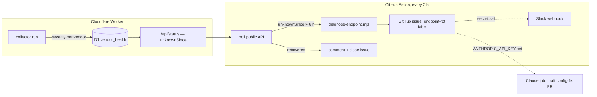

# Endpoint-rot watchdog — design

Status: approved by maintainer 2026-08-12 (channel, analysis depth, and
threshold chosen via structured questions; build approved same day).

## Problem

When a vendor decommissions or moves its status endpoint, the board fails
closed to `unknown` — correctly — and then sits there until a human notices,
diagnoses, and repoints config. SendGrid demonstrated the full arc on
2026-08-12: `status.sendgrid.com`'s stale CNAME served a `*.statuspage.io`
certificate (HTTP 526 from the Worker), the page had been decommissioned
outright, and the fix was a config repoint to Twilio's page. The diagnosis
took tooling and time a dashboard should provide by itself. Per the standing
rule, an unknown that persists is a defect to root-cause, never a steady
state.

The existing dead-man monitor (`.github/workflows/staleness-monitor.yml`)
watches **whole-board freshness** — collection stalled, D1 dead, Worker gone.
This watchdog is its per-vendor sibling: the board is healthy, one vendor's
endpoint has rotted.

## Decisions (maintainer, 2026-08-12)

| Decision | Choice |
|---|---|
| Notification | GitHub issue (canonical, universal for forks) + optional webhook (Slack-compatible), skipped when the secret is absent |
| Analysis | Deterministic diagnosis always; AI fix-proposal only where `ANTHROPIC_API_KEY` exists |
| Threshold | 6 hours of continuous `unknown` (~24 failed cycles) |

## Architecture



Detection lives in the Worker because only the Worker sees every cycle;
diagnosis and notification live in a scheduled Action because that is where
real network tooling, `GITHUB_TOKEN`, and fork-universality are free.

## Component 1 — Worker: persistence tracking

**New D1 table** (versioned migration, additive only):

```sql
CREATE TABLE IF NOT EXISTS vendor_health (
  vendor        TEXT PRIMARY KEY,
  failing_since TEXT NOT NULL,   -- ISO-8601, first unknown of the current streak
  failures      INTEGER NOT NULL -- consecutive unknown collections
);
```

**Write path** (in the scheduled handler, after the snapshot write, same
transaction boundary as the shard's other writes):

- For each vendor **this shard checked**: severity `unknown` → upsert
  (`failing_since` kept from the existing row, `failures + 1`); any other
  severity → `DELETE` the row. A shard touches only its own vendors — the
  `DELETE FROM snapshot` sharding rule applies here identically.
- **`budgetExhausted` runs are skipped entirely** — 17 simultaneous unknowns
  from an exhausted budget are an operator fault, not vendor rot, and must
  not start 17 streaks.

**Read path**: `/api/status` records gain an optional `unknownSince` field
(ISO-8601) when a `vendor_health` row exists for that vendor. Absent
otherwise — the field's absence is the healthy case, so old clients and the
dashboard render unchanged.

## Component 2 — Action: diagnosis + notification

`.github/workflows/endpoint-rot-watchdog.yml`, cron `17 */2 * * *` +
`workflow_dispatch`, permissions `contents: read, issues: write`.

Flow per run:

1. `curl` the public `/api/status`; select records where `unknownSince` is
   older than `WATCHDOG_THRESHOLD_HOURS` (env, default 6).
2. Dedupe: skip vendors that already have an **open** issue labeled
   `endpoint-rot` whose title names them (`endpoint-rot: <vendor>`).
3. For each new rotted vendor, run `scripts/diagnose-endpoint.mjs <url>`
   (plus the per-cloud/statusUrls variants from config where present) and
   file the issue with the structured diagnosis.
4. Recovery sweep: for each open `endpoint-rot` issue whose vendor now
   reports a determinable severity (or no longer exists in config), comment
   with the recovery time and close it.
5. Webhook: when the `WATCHDOG_WEBHOOK_URL` secret is non-empty, POST
   Slack-compatible `{"text": "<vendor> endpoint rot: <classification> — <issue url>"}`
   on issue creation and closure. Absent secret → step silently skipped, so
   forks need zero setup.

**`scripts/diagnose-endpoint.mjs`** — Node ≥18 stdlib only, two layers:

- *Probes* (thin, network): DNS CNAME/A chain (`node:dns/promises`), TLS
  handshake capturing certificate subject/SANs vs hostname (`node:tls`),
  HTTP GET following redirects manually (≤5, recording the chain), body
  sniff (content-type, JSON-parseability, first bytes).
- *Classifier* (pure function over the probe results — unit-testable with
  zero network): `dns-failure`, `tls-cert-mismatch`,
  `decommissioned` (redirect chain leaves the configured host, the SendGrid
  signature), `http-4xx` / `http-5xx`, `body-not-json`, and
  `endpoint-ok-likely-adapter-drift` (200 + parseable JSON — the endpoint is
  fine, the adapter or scope no longer matches it; points at config/vendor
  drift rather than relocation).

Each classification carries a suggested-fix playbook line in the issue body
(e.g. decommissioned → "find the vendor's new status page; repoint config,
scope if shared — see the SendGrid repoint, PR #84, as the worked example").
Issue body includes raw evidence (DNS chain, cert subject, redirect chain,
HTTP codes) so the fix decision needs no re-probing. Vendor payload text is
third-party content: the issue renders evidence in fenced code blocks,
never interpolated into markdown structure.

## Component 3 — optional AI fix proposal (second milestone)

A separate job in the same workflow, running only when `ANTHROPIC_API_KEY`
is configured (checked via env indirection — `secrets.*` cannot appear in
`if:` directly). It hands the diagnosis to `anthropics/claude-code-action`
with a prompt to locate the relocated endpoint and open a **draft** config
PR referencing the issue — gates still apply; nothing merges without the
human. Shipped as a follow-up PR if the action wiring proves fiddly; the
deterministic baseline never depends on it.

## Testing

- **Worker/engine**: streak upsert/clear/skip-on-budgetExhausted unit tests
  against the D1 test helper; contract test that `/api/status` carries
  `unknownSince` iff a row exists (and omits it otherwise).
- **Diagnosis**: classifier tests over recorded probe-result fixtures — the
  SendGrid case (CNAME to `stspg-customer.com`, `*.statuspage.io` cert,
  302 off-host) must classify `decommissioned`; plus one fixture per class.
  Red-first per house TDD.
- **Workflow**: `actionlint` + `zizmor` already gate workflows; the
  jq/gh plumbing stays thin enough to read. `workflow_dispatch` allows a
  manual end-to-end rehearsal against the live board.

## Documentation (same commits, not follow-ups)

- README: new watchdog section (what fires, what the issue looks like, how
  forks configure the webhook/AI key — or nothing), architecture diagram
  updated (docs-render gate covers the Mermaid).
- CLAUDE.md: verification section gains the watchdog as a signal source;
  settled-decisions note that `unknownSince` semantics are streak-based and
  budget-exhaustion-blind.
- `config/vendors.json` header: nothing (no config surface changes).
- CHANGELOG via release-please (feat commit).

## Non-goals

- No severity judgment changes — the watchdog observes `unknown`, it never
  votes.
- No replacement of the dead-man monitor — complementary, documented as such.
- No paging/alerting infrastructure beyond the issue + webhook.
