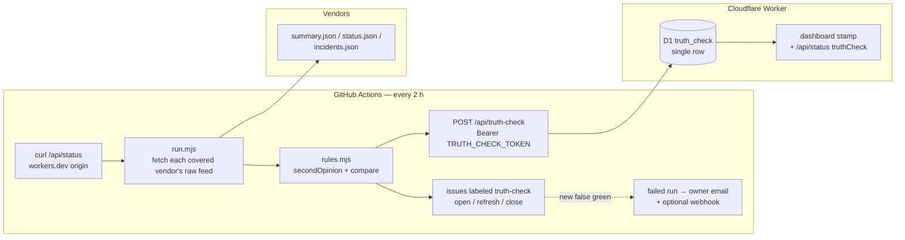

# Truth check — design

Worklist #34 (maintainer, 2026-08-28): "a board that's not verified is no good
to anyone." Written 2026-09-05, shipped the same sitting.

## Problem

The monitors that existed validated plumbing only. The dead-man monitor asks
whether the collector is running; the endpoint-rot watchdog asks whether a
vendor is stuck at `unknown`. Neither asks the question the board exists to
answer: **we render operational — does the vendor agree?**

On 2026-08-28 an open Google Chat incident rendered as "37 components · all
healthy" because the adapter filed `SERVICE_INFORMATION` under cleared
(PR #123). Every monitor was green. The hand-written Google fixture lacked
`most_recent_update`, exactly where the bug lived, so the test suite could not
have caught it either.

## Decisions (maintainer, 2026-08-28; refined 2026-09-05)

1. **A second opinion by a different code path.** The check must not share
   the adapter's parsing or its severity vocabulary. If the two disagree, one
   of them is wrong and a human decides which; if they share code, they share
   bugs.
2. **The vendor's own verdict, read the dumbest way that vendor offers.** For
   Atlassian Statuspage that is the page-level `status.indicator`; for a
   component- or group-scoped vendor it is the states of the in-scope
   components (the operator has declared what matters, and the settled
   decision ignores the page indicator there — Cloudflare's PoP re-routing);
   for Instatus `page.status`; for SorryApp `page.state`; for Oracle the
   173-byte page-level `status.json` rather than the 1.6 MB components
   document the adapter reads; for Google, which publishes no indicator, an
   incident with no `end` time.
3. **Open incidents are evidence, not a vote.** The worklist wording said
   "open incident ⇒ we must not render operational". Applied literally to
   Statuspage vendors that contradicts the settled decision that incidents
   inform context and never severity (KnowBe4: an incident about their online
   store while the indicator read `none`) and would flag such vendors on
   every run. The rule therefore lists open incidents in the evidence so the
   issue carries them, and takes the verdict from the indicator. Google is the
   exception by necessity: the incident IS the vendor's verdict there.
4. **Refuse rather than guess.** A platform the rule does not understand is
   `uncovered` and counted as such on the stamp; a payload it cannot read is
   `unreadable`, never `fine`. Coverage on 2026-09-05: 36 of 49 vendors —
   the 13 uncovered are AWS and Discord (region lenses the dumb rule does not
   reproduce), Microsoft (composite of non-Statuspage sources), and the
   bespoke adapters (Apple, Concur, Docusign, IBM Cloud, Meta, Okta, Signal,
   Stormboard, Tableau, Zscaler).
5. **One disagreement class alerts, and only when it persists.** *False green* — the board renders
   `operational` while the vendor's verdict is trouble — files an issue and
   emails once. *Over-cautious* (board says trouble, vendor says fine: a
   lagging clear or a scope decision) is reported, never paged. `unknown`
   rows belong to the endpoint-rot watchdog and are skipped.
6. **Verification is visible on the board.** The workflow stamps the board
   through an authenticated endpoint; the page renders "Truth-checked
   ‹time› against N of M vendors' own feeds · no disagreements" and turns
   the line into a stale warning after three hours. A missing stamp reads
   "Not yet truth-checked". The stamp is the dead-man's switch for the
   truth check itself.

## Architecture

Same shape as the watchdog: a pure, unit-tested half (`scripts/truth-check/
rules.mjs`, recorded fixtures, no network) and a thin network half
(`scripts/truth-check/run.mjs`) the workflow drives.

## Component 1 — rules (`scripts/truth-check/rules.mjs`)

- `probeUrlsFor(vendor)` — the raw feeds the second opinion needs; `[]` means
  uncovered. Oracle derives `/api/v2/status.json` from the configured feed's
  origin; a composite is covered only when every source is Statuspage.
- `secondOpinion(vendor, bodies)` — `{covered, verdict, evidence, urls}` with
  verdict `fine | trouble | unreadable | uncovered`. Never throws.
- `compare(records, opinions)` — `{falseGreen, overCautious, unreadable,
  covered, total, agreed}`.

Tested against recorded payloads in `test/scripts/truth-check.test.js`,
including the Cloudflare fixture (indicator `minor` from PoP re-routing, in
scope all operational → fine) and the KnowBe4 fixture (indicator `none`, one
open incident → fine with the incident in evidence).

## Component 2 — network half + workflow

`run.mjs` fetches every unique probe URL (20 s timeout, 5 MB cap, six at a
time, BOM-tolerant JSON), applies the rules and writes `report.json`; exit
code always 0 — a fetch failure is `unreadable`, never a crash and never a
silent fine.

`.github/workflows/truth-check.yml` (cron `41 */2 * * *`, `workflow_dispatch`):

1. fetch `/api/status` from the workers.dev origin (bot management
   challenges runners on the public hostname — same as the other monitors);
2. run the comparison; if it finds a false green, wait ten minutes and run
   it again — the board re-collects each vendor every 15 minutes, so a
   vendor that just went down reads as false green until its shard runs.
   Only a disagreement that survives the second pass is acted on (found
   during the live dry run: a stale board snapshot produced a one-off false
   green that a fresh fetch cleared);
3. per false green: open an issue `truth-check: <vendor>` labeled
   `truth-check` (vendor evidence, source URLs, what the board rendered), or
   comment on the open one; close any open issue whose vendor agrees again;
   mirror opens to `WATCHDOG_WEBHOOK_URL` when set;
4. stamp the board when `TRUTH_CHECK_TOKEN` is set, else say so and skip;
5. fail the run only when a NEW issue was filed this run — one email per new
   false green, not one every two hours while it persists.

Forks need zero configuration: issues ride `GITHUB_TOKEN`.

## Component 3 — Worker: stamp

- Migration `0003_truth_check.sql`: single-row `truth_check` (checked_at,
  covered, total, agreed, disagreements, detail JSON).
- `POST /api/truth-check`: 501 until the deployment sets the
  `TRUTH_CHECK_TOKEN` Worker secret; 401 on a missing or wrong bearer
  (length-independent compare); 400 on a malformed or out-of-bounds body
  (the workflow is a trust boundary too); 204 on success; 405 for any other
  method. Names in the stamp render escaped like every vendor string.
- `/api/status` gains `truthCheck` (null when never checked); the dashboard
  renders the stamp under the collection line, stale after three hours.

## Component 4 — golden feeds

`test/fixtures/Google-appsstatus-2026-09-05.json` is the live feed recorded
2026-09-05 (46 incidents, all closed — the day the fixture was cut nothing
was open); `Google-appsstatus-open.json` is one real incident from it with
`end` removed and `most_recent_update.status` set to `SERVICE_INFORMATION`,
the shape of the 2026-08-28 misreport, plus five closed ones. The adapter and
the rule are both exercised against real shapes.

## Component 5 — logo manifest fail-closed (folded in)

`scripts/logo-manifest.mjs` `reconcileManifest(previous, onDisk,
configuredSlugs)`: a refused download never shrinks the manifest; an entry
leaves only when its vendor leaves config; a configured vendor whose
committed logo this clone cannot serve stops the build with instructions.
Wired into `scripts/fetch-logos.mjs`; the 2026-08-28 hume deploy (five
refused favicons, five logos gone from the live board) is the pinned case.
Note for operators: a fresh `--force` re-fetch can change a vendor's file
extension (`.png` → `.ico`/`.svg`) and legitimately churn the manifest.

## Testing

- `test/scripts/truth-check.test.js` — 20 tests over recorded payloads.
- `test/worker/truth-check.test.js` — storage round-trip, endpoint
  (501/401/400/204/405), stamp rendering (never / fresh / disagreements /
  overdue / escaping).
- `test/scripts/logo-manifest.test.js` — the refused-download rule.
- Coverage gate unchanged (per-file 75, storage 90).
- Live dry run 2026-09-05 00:39 CDT against the production board: 36/49
  covered, 36 agree, 0 false green, 0 unreadable.

## Documentation (same commits)

README Monitoring (third monitor + `TRUTH_CHECK_TOKEN`), Data model ERD
(`truth_check`), Deploy your own (the secret pair), Troubleshooting (the
manifest refusal), Project structure; CLAUDE.md settled decision; this spec.

## Rollout

1. Merge; on hume: `wrangler d1 migrations apply vendor-dashboard --remote`
   and `wrangler deploy` (the logo step now refuses to ship a shrunken
   manifest, so `npm run deploy` is safe again once the icons are present).
2. `wrangler secret put TRUTH_CHECK_TOKEN` (random 32 bytes) on the Worker,
   and the same value as the Actions secret `TRUTH_CHECK_TOKEN` (maintainer:
   the fine-grained tokens on this machine cannot write repo secrets).
3. `gh workflow run truth-check.yml`; confirm the issue label, the stamp on
   the board, and the summary in the run log.

## Non-goals

- Reproducing region scoping (AWS, Discord) or the bespoke adapters in the
  dumb rule — coverage is stated, not faked; extend `rules.mjs` per platform
  with a recorded fixture when a misreport shows the need.
- Alerting on over-cautious rows.
- Replacing the adapter tests: golden feeds complement the hand-written
  fixtures, they do not retire them.
